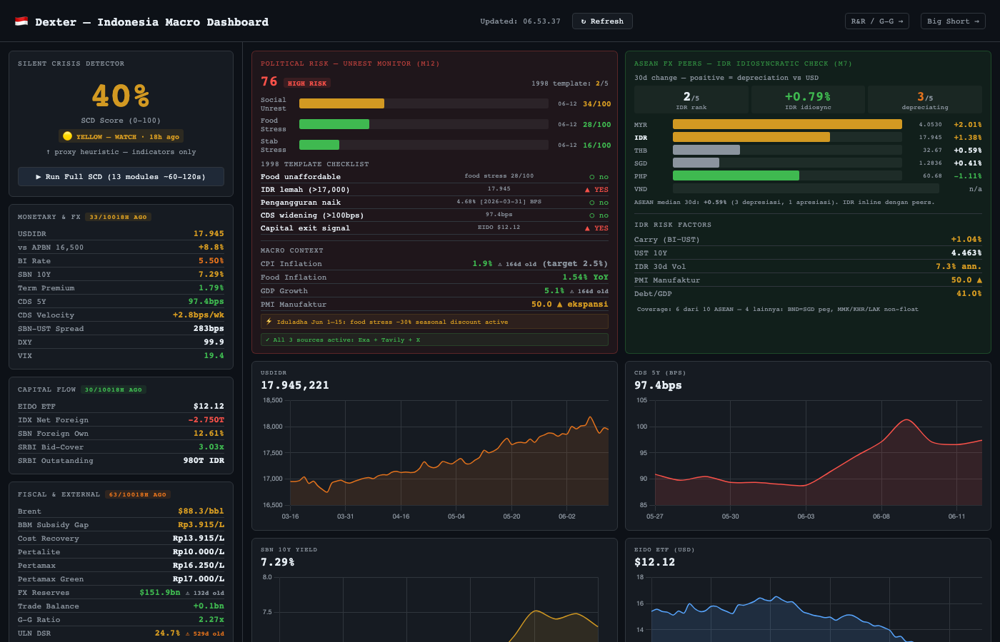
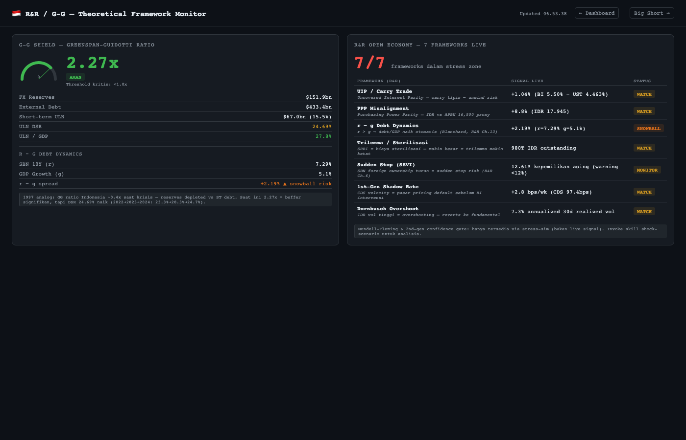
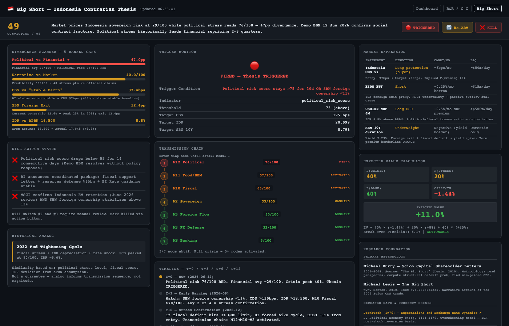

# dex_indonesia 🇮🇩

**Indonesia Sovereign Macro Intelligence System** — fork dari [virattt/dexter](https://github.com/virattt/dexter), dikustomisasi untuk monitoring risiko sovereign Indonesia secara institusional.

> **Tentang fork ini:** Repository ini bukan general-purpose financial agent. Fokus tunggal: deteksi dini krisis sovereign Indonesia sebelum pasar repricing — *Big Short mode* untuk IDR, SBN, dan IHSG. Dan mungkin MBG!


---

## Apa itu Dexter (aslinya)?

Dexter dibuat oleh [@virattt](https://twitter.com/virattt) sebagai autonomous financial research agent — think Claude Code, tapi khusus untuk riset keuangan. Ia bisa decompose pertanyaan finansial kompleks, eksekusi riset bertahap, self-validate, dan iterasi sampai dapat jawaban berbasis data.

**Kemampuan asli Dexter:**
- Task planning otomatis untuk riset keuangan
- Akses real-time: income statement, balance sheet, cash flow
- Self-reflection dan loop detection
- WhatsApp gateway (chat langsung dari HP)
- Eval suite dengan LangSmith tracking

Semua kemampuan asli di atas **tetap ada** di fork ini.

---

## Apa yang ditambahkan di fork ini?

### Big Short Mode — Silent Crisis Detector

13 modul macro intelligence khusus Indonesia, berjalan paralel, agregat ke satu angka: **Silent Crisis Probability (0–100%)**.

```
Silent Crisis Probability: 21%  🟢 GREEN
Synthetic Stability Score: 44/100
Cross-confirmed modules: 1/13
```

| # | Modul | Signal |
|---|-------|--------|
| M1 | BoP | Trade balance, FX reserves, synthetic CAD risk, Greenspan-Guidotti cross-feed |
| M2 | Sovereign Risk | CDS 5Y + velocity (bps/week), SBN yield, foreign SBN %, term premium (ORANGE ≥2%), **BI yield policy flag** (Perry Jun 10 2026), **S&P interest/revenue proximity risk** (>15% = negative watch; current: 20.4%) |
| M3 | FX Defense | USDIDR z-score, pseudo-stability, BI intervention, **SRBI auction bid-cover** (weekly capital flow proxy — 1wk lead vs DJPPR), 1st/2nd-gen crisis gates |
| M4 | Commodity | Ekspor basket (coal/CPO/nickel/LNG), oil import vulnerability, ICP threshold watch |
| M5 | Foreign Flow | EIDO ETF, silent exit detection, SSVI (Sudden Stop Vulnerability Index), **MSCI EM classification risk** (June 2026 review), May 2026 rebalancing outflow |
| M6 | Narrative Divergence | Official guidance vs market — APBN assumptions vs aktual, BBM narrative vs cost recovery |
| M7 | ASEAN Relative Value | IDR idiosyncratic component vs ASEAN peers (supplementary — not in SCD weight) |
| M8 | Banking Stress | NPL (OJK/World Bank API), LDR, CAR, IndONIA corridor (DFR = BI Rate −100bps / LF = BI Rate +75bps), FSAP nexus (implied CAR hit), KLR signals, M2/FX reserves ratio, **BNPL sub-indicator** (OJK IKNB fintech NPL) |
| M9 | Market Stress | IHSG P/E + breadth, valuation disconnect |
| M10 | Fiscal | APBN realisasi vs target, revenue shortfall, deficit trajectory, **S&P interest/revenue threshold** (≥15% = negative action watch; BI hike cycle uplift computed) |
| M11 | Domestic Pressure | PIHPS 10 komoditas pangan + BBM subsidy gap (cost recovery vs Pertalite) + ICP threshold watch |
| M12 | Political Risk | Unemployment + Exa news sentiment + **X API v2 real-time social feed** (unrest detection, minute-zero before Exa publishes) |
| M13 | ULN / External Debt | DSR (IMF threshold 25%), Greenspan-Guidotti ratio, ULN/GDP, BI hedging compliance (PBI 21/14/2019), 1997 transmission mechanism |

**Logika inti:** Satu modul di RED bisa noise. Dua modul di ORANGE = deteriorasi struktural. Tiga+ = systemic fragility.

### Research Frameworks

**KLR EWS (Kaminsky-Reinhart-Lizondo):**
21-indicator dual crisis signal matrix (12 currency + 9 banking). Threshold-based early warning kalibrasi untuk EM. Includes Module 13 ULN signals: Greenspan-Guidotti ratio (<1.0), DSR (>25%), hedging compliance (<70%). Crisis probability: LOW (0–3 sinyal), MODERATE (4–7), HIGH (8–12), CRITICAL (13+). Invoke via skill `klr-ews`.

**IMF FSAP Sovereign-Bank Nexus:**
SBN yield shock → implied bank CAR erosion: `(sbn_10y − 6.5% baseline) × 6yr duration × 20% SBN/assets`. At +100bps: −1.2pp CAR. Doom loop signal di >1.5pp. Terintegrasi langsung ke Module 8 scoring.

**BI Interest Rate Corridor:**
IndONIA harus stay dalam corridor DFR (BI Rate −100bps) sampai LF Rate (BI Rate +75bps). Spread >30bps = YELLOW, >50bps = ORANGE, >75bps = RED (BI terpaksa inject liquidity = crisis signal).

**Rivera-Batiz & Rivera-Batiz (R&R) — International Finance & Open Economy Macroeconomics:**

Framework teoritis utama yang di-embed ke dalam sistem ini. Setiap sinyal berikut bukan heuristic — ada basis teori makro terbuka yang eksplisit:

| Framework R&R | Chapter | Diimplementasikan di | Sinyal yang dihasilkan |
|---------------|---------|----------------------|------------------------|
| Purchasing Power Parity (PPP) | Ch. 4–5 | Module 6 (Narrative Divergence) | USDIDR vs PPP fair value; Dornbusch overshoot flag |
| Uncovered Interest Parity (UIP) | Ch. 5 | Module 7 (ASEAN RV) | UIP Carry Attractiveness Index: real carry = SBN spread − IDR depreciation. Leads Module 5 foreign flow 2–3 minggu |
| Mundell-Fleming Open Economy | Ch. 8 | Stress Simulator | MBG fiscal shock: ΔG → ΔIDR → term premium → foreign flow (param `fiscalOverrunIdrT`) |
| Dornbusch Overshooting | Ch. 10 | Stress Simulator | IDR shock >15%: short-run overshoot sebelum PPP mean-reversion. Note otomatis di output |
| Trilemma (Mundell) | Ch. 11 | Module 10 (Fiscal) | SRBI sterilization cost: open capital + monetary autonomy → wajib sterilisasi → quasi-fiscal drag BI |
| r-g Debt Dynamics | Ch. 14–16 | Module 13 (ULN) | r−g = SBN 10Y − GDP growth. Jika positif tanpa primary surplus → debt/GDP expands mechanically |
| 1st-gen Crisis (Krugman-FG) | Ch. 12 | Module 3 (FX Defense) | Shadow exchange rate + months-to-attack: GG breach vs SRBI ceiling binding constraint |
| 2nd-gen Self-fulfilling Crisis | Ch. 13 | Module 3 (FX Defense) | Confidence Gate: DC vs AC balance → SAFE / VULNERABLE / ATTACK zone. Upgrades alert to ORANGE if ATTACK |
| Sudden Stop (Calvo) | Ch. 15 | Module 5 (Foreign Flow) | Sudden Stop Vulnerability Index (SSVI): SBN cliff (0.30) + UIP carry (0.25) + EIDO trend (0.25) + GG ratio (0.20) → 0–100, phase low/watch/elevated/imminent |

**Contoh output r-g (Module 13):**
```
### R-G Debt Dynamics (R&R Ch.14–16)
r−g = SBN 10Y 6.71% − GDP growth 5.40% = +1.31pp [KNIFE-EDGE]
Debt/GDP: 27.8% → Primary surplus needed to stabilize: +0.36% GDP
Flag: R-G ADVERSE — without primary surplus, debt/GDP expands mechanically
```

### Shock Scenario Simulator

Forward-looking stress test — simulasi bagaimana satu atau compound shock mengubah seluruh 13 modul sekaligus. Tersedia sebagai CLI script (`scripts/shock-scenario.ts`) maupun skill agent (`shock-scenario`).

```bash
bun scripts/shock-scenario.ts --list          # lihat semua preset
bun scripts/shock-scenario.ts crisis          # 1997/2008 severity analog
bun scripts/shock-scenario.ts idr-freefall    # sudden stop + forced BI hike
bun scripts/shock-scenario.ts moderate        # baseline stress test
# Custom parameter override
bun scripts/shock-scenario.ts moderate --sbn 8.5 --usdidr 21000 --npl 4.5
```

**10 named presets (CLI script):**

| Preset | Deskripsi | SBN Δ | USDIDR Δ | Reserves Δ |
|--------|-----------|-------|----------|------------|
| `mild` | Early deterioration | +50bps | +1,500 | −$20bn |
| `moderate` | Standard stress | +100bps | +3,000 | −$40bn |
| `severe` | Pre-crisis | +150bps | +5,000 | −$60bn |
| `crisis` | 1997/2008 analog | +250bps | +8,000 | −$80bn |
| `trump-tariff` | US tariff shock + EM selloff | +75bps | +2,000 | −$15bn |
| `em-selloff` | Global EM risk-off | +125bps | +4,000 | −$35bn |
| `oil-spike` | Commodity shock + imported inflation | +50bps | +1,000 | −$10bn |
| `idr-freefall` | Sudden stop + forced BI hike | +150bps | +5,000 | −$50bn |
| `bank-crisis` | Credit shock (NPL surge) | +100bps | +2,000 | −$20bn |
| `bi-hike` | Aggressive rate tightening | +200bps | +1,000 | −$5bn |

**3 additional presets (agent skill only — invoke via `shock-scenario` skill, not CLI):**

| Preset | Deskripsi | Primer melalui |
|--------|-----------|----------------|
| `china-slowdown` | China demand shock: coal/CPO/nickel −30%, GG mendekati 1.8, DSR crosses 25% | Step 3H |
| `bi-rate-cut` | Premature BI rate cut −50bps: SBN repricing net +80bps, IDR jatuh +1,200, confidence gate check | Step 3I |
| `sovereign-downgrade` | Rating downgrade ke BB+: CDS +100bps, SBN +125bps, IG-mandate exit ~$19bn, doom loop check | Step 3J |

**Output per scenario:**
- Before vs After score tiap modul (GREEN/YELLOW/ORANGE/RED)
- Transmission chain narrative (doom loop detection, fiscal breach, foreign ownership buffer)
- Silent Crisis Probability: Before → After
- Critical thresholds yang terlewati

**Contoh output (Full Crisis):**
```
## Shock Scenario: Full Crisis
Baseline regime: Q3 — Stagflation (Growth↓ Inflation↑)

| Module         | Before       | After        | Alert Δ       |
|----------------|--------------|--------------|---------------|
| FX Defense     | 32 🟢 GREEN  | 100 🔴 RED   | GREEN→RED     |
| Sovereign Risk | 16 🟢 GREEN  |  97 🔴 RED   | GREEN→RED     |
| Banking Stress |  2 🟢 GREEN  | 100 🔴 RED   | GREEN→RED     |
| Fiscal         | 33 🟡 YELLOW |  55 🟠 ORANGE| YELLOW→ORANGE |

Silent Crisis Probability: 24% 🟢 → 85% 🔴
DOOM LOOP TERRITORY: CAR erosion 3.26pp (threshold >1.5pp)
```

### APBN 2026 Baseline

UU No. 17 Tahun 2025 / Perpres No. 118 Tahun 2025:
- USDIDR: 16,500 | ICP oil: $70/bbl | GDP growth: 5.4% | CPI: 2.5%
- Revenue: 3,154T | Spending: 3,843T | Deficit: 2.68% GDP

**Live deviations (Jun 2026):**
- BI Rate: **5.50%** — inter-cycle hike Jun 9 2026 (+25bps, rationale: IDR stabilization)
- Term premium: **1.98%** (SBN 10Y 7.48% − BI Rate 5.50%) — borderline ORANGE (threshold 2.0%)
- S&P interest/revenue ratio: **~20.4%** (belanja bunga 552.7T + BI hike uplift 9T vs revenue 2,756T) — 5.4pp above S&P 15% negative-watch threshold
- USDIDR spot: **~18,000** vs APBN assumption 16,500 — 9% gap

### BBM Subsidy Monitoring (Module 11)

Module 11 (Domestic Pressure) tracks domestic fuel prices against cost recovery, computing the subsidy gap that drives fiscal stress and political risk.

**Regulatory basis:**

| Regulasi | Nomor | Tentang |
|----------|-------|---------|
| Kepmen ESDM | [245.K/MG.01/MEM.M/2022](https://jdih.esdm.go.id/dokumen/view?id=2307) | Formula harga dasar BBM umum (amends Kepmen 62.K/12/MEM/2020) |
| Kepmen ESDM | 62.K/12/MEM/2020 | Formula harga jual eceran BBM — dasar hukum awal |
| Kepmen ESDM | [tentang harga jual eceran BBM tertentu](https://migas.esdm.go.id/post/kepmen-esdm-tentang-harga-jual-eceran-bbm-jenis-tertentu-dan-khusus-penugasan) | BBM bersubsidi (Pertalite, Solar) — jenis tertentu dan khusus penugasan |

**Harga BBM per 10 Juni 2026** (sumber: [Bisnis.com](https://ekonomi.bisnis.com/read/20260610/44/1979770/pertamax-naik-nyaris-rp4000-per-liter-daftar-harga-terbaru-bbm-pertamina) | [CNBC Indonesia](https://www.cnbcindonesia.com/news/20260610000254-4-741535/resmi-harga-bbm-pertamax-naik-jadi-rp-16250-liter-mulai-10-juni-2026)):

| Jenis | Harga | Tipe | Keterangan |
|-------|-------|------|------------|
| Pertalite (RON 90) | IDR 10.000/liter | Bersubsidi | Tidak berubah sejak Sep 2022 — dilindungi komitmen Bahlil |
| Solar / Biosolar B40 | IDR 6.800/liter | Bersubsidi | Tidak berubah |
| Pertamax (RON 92) | IDR 16.250/liter | Non-subsidi | **+Rp3.950 efektif 10 Jun 2026** (dari 12.300); Pertamina Patra Niaga |
| Pertamax Green (RON 95) | IDR 17.000/liter | Non-subsidi | **+Rp4.100 efektif 10 Jun 2026** (dari 12.900) |
| Pertamax Turbo | IDR 20.750/liter | Non-subsidi | RON 98, bensin premium; tidak berubah |
| Dexlite (CN 51) | IDR 23.000/liter | Non-subsidi | Solar diesel non-subsidi; harga ikut MOPS Gasoil Singapore — sangat sensitif krisis Hormuz |
| Pertamina Dex (CN 53) | IDR 24.800/liter | Non-subsidi | Solar diesel premium, mesin high-performance; harga tertinggi — turun sedikit per Jun 2026 |

**Bahlil Statement — Verbatim Record:**


> *"Saya sampaikan kepada publik, bahwa insyaallah stok kita di atas standar minimum, baik itu solar, baik itu bensin, maupun LPG. Insyaallah aman, dan sekali lagi saya katakan bahwa kami sudah bersepakat atas arahan Bapak Presiden, bahwa harga BBM untuk subsidi tidak akan dinaikkan sampai dengan akhir tahun."*
>
> *"Doain, ini kan tergantung dengan harga ICP, tapi kalau sampai dengan 100 dolar itu sudah aman BBM. Dan sekarang harga rata-rata ICP Januari sampai dengan sekarang itu tidak lebih dari USD77."*
>
> — Menteri ESDM **Bahlil Lahadalia**, Istana Negara Jakarta, **16 April 2026**
> Sumber: [ESDM.go.id](https://www.esdm.go.id/id/media-center/arsip-berita/menteri-bahlil-harga-bbm-subsidi-tak-naik-hingga-akhir-tahun) | [Tempo.co](https://www.tempo.co/ekonomi/alasan-harga-bbm-subsidi-tidak-naik-hingga-akhir-2026-2129627) | [Tribun Jateng](https://jateng.tribunnews.com/nasional/1253476/ternyata-ini-syarat-agar-harga-bbm-subsidi-dan-elpiji-tidak-naik-bahlil-enggak-gampang)

**Konteks keputusan:** Arahan Presiden Prabowo Subianto pasca kunjungan ke Rusia dan Prancis. Indonesia memiliki production deficit ~1 juta bbl/hari (konsumsi 1,6M bbl/hari vs produksi domestik 600–610k bbl/hari) — sangat rentan terhadap shock harga global.

**Kondisi komitmen (hard clause):**
- ICP ≤ $100/bbl → BBM subsidi **tidak naik**
- ICP > $100/bbl → komitmen **gugur** — hike menjadi keharusan fiskal
- ICP YTD rata-rata Jan–Apr 2026: $77/bbl (saat pernyataan dibuat, margin $23)
- **Per 10 Juni 2026: Brent $92.6 — margin tersisa hanya $7.4/bbl** ⚠️ (BI Rate inter-cycle hike + Pertamax naik 32% dalam satu hari)

---

**Hormuz 2026 — Situation Report (SitRep)**

*Sumber utama: [Wikipedia: 2026 Strait of Hormuz crisis](https://en.wikipedia.org/wiki/2026_Strait_of_Hormuz_crisis) | [CNBC: Iran vows to completely block Hormuz](https://www.cnbc.com/2026/06/01/iran-us-negotiations-strait-of-hormuz.html) | [Al Jazeera](https://www.aljazeera.com/news/2026/6/5/how-the-us-naval-blockade-has-bled-iran-of-nearly-6bn-in-oil-revenues) | [Britannica](https://www.britannica.com/event/2026-Iran-war)*

| Tanggal | Event |
|---------|-------|
| **28 Feb 2026** | US-Israel luncurkan Operation Epic Fury; serangan terhadap fasilitas militer & nuklir Iran; Khamenei tewas |
| **1–4 Mar 2026** | IRGC mulai blokade; kapal tanker *Skylight* diserang; IRGC klaim kontrol penuh 4 Mar |
| **8 Mar 2026** | Brent tembus **$100/bbl** untuk pertama kali dalam 4 tahun; peak $126/bbl |
| **19 Mar 2026** | Dubai crude record **$166/bbl** — kenaikan bulanan terbesar dalam sejarah |
| **27 Mar 2026** | IRGC umumkan penutupan selat untuk kapal menuju/dari pelabuhan AS, Israel, dan sekutu |
| **8 Apr 2026** | Gencatan senjata sementara; Iran mulai pungut **toll >$1 juta/kapal** |
| **13–29 Apr 2026** | US Navy implementasi counter-blockade pelabuhan Iran |
| **4 Mei 2026** | Operation Project Freedom: US Navy kawal kapal dagang; di-pause 6 Mei |
| **1 Jun 2026** | Iran hentikan negosiasi dengan AS; **vow to completely block Hormuz** |
| **9 Jun 2026** | Status: ~5% traffic normal (~600 tanker tertahan di Teluk Persia, 240+ menunggu di luar) |

**Dampak global:**

| Metric | Data |
|--------|------|
| Pra-krisis (baseline) | Brent ~$70–80/bbl |
| Peak Brent | **$126/bbl** (Mar 2026) |
| Peak Dubai crude | **$166/bbl** (19 Mar 2026) |
| Penurunan traffic | 70% dalam 48 jam pertama → ~0% saat ini |
| Ekspor regional turun | 60% (dari 25M ke ~10M bbl/hari) |
| Kapal tertahan | 20.000 pelaut + 2.000 kapal di Teluk Persia (per 21 Apr) |
| LNG Eropa | €30 → €60+/MWh |

Sebelum krisis: **25% seaborne oil** + **20% LNG dunia** melewati Hormuz. Kapasitas pipeline alternatif ~9M bbl/hari — tidak cukup menggantikan 20M bbl/hari via Hormuz.

**Implikasi langsung untuk Indonesia:**

| Skenario | Brent | ICP Proxy | Subsidy Gap/Liter | ICP Alert | Action |
|----------|-------|-----------|-------------------|-----------|--------|
| Baseline APBN | $70 | $70 | ~IDR 0 | 🟢 GREEN | Tidak ada |
| Saat ini (10 Jun) | **$92.6** | ~$92.6 | **IDR 4.680** | 🟠 ORANGE | Monitor ketat |
| Threshold Bahlil | $100 | $100 | ~IDR 7.200 | 🔴 RED | Komitmen gugur |
| Peak Mar 2026 | $126 | $126 | ~IDR 12.800 | 🔴 RED | Hike wajib fiskal |
| Eskalasi baru | $110+ | $110+ | ~IDR 9.000+ | 🔴 RED | Hike + social unrest |

**CATATAN PENTING:** Iran pada 1 Juni 2026 menghentikan negosiasi dan mengumumkan akan **menutup penuh** Hormuz. Jika terealisasi → Brent bisa kembali ke $110–120 range → ICP melewati $100 → komitmen Bahlil gugur → hike BBM → trigger M12 political risk flashpoint.

**Cost recovery formula:**
```
cost_recovery (IDR/liter) = (Brent_USD / 158.987) × USDIDR × 1.40
```
Faktor 1.40 = crude 100% + kilang 20% + distribusi 10% + margin+pajak 10%

**Alert thresholds (ICP):**
- GREEN: ICP < $80/bbl
- YELLOW: $80–90/bbl (Hormuz risk zone)
- ORANGE: $90–100/bbl (approaching commitment threshold)
- RED: > $100/bbl — **APBN commitment breaking point, hike imminent**

**Alert thresholds (subsidy gap per liter):**
- GREEN: gap < IDR 2.000
- YELLOW: IDR 2.000–4.000 (burden building)
- ORANGE: IDR 4.000–7.000 (analogous to mid-2022 sebelum hike Sep 2022)
- RED: > IDR 7.000 (hike imminent — fiscal tidak tahan)

**Emergency override (tanpa redeploy):**
Jika pemerintah umumkan kenaikan harga BBM, update langsung via env var:
```bash
# .env — BBM price overrides (no redeploy needed)
PERTALITE_PRICE_IDR=12000     # harga baru setelah naik (subsidi)
SOLAR_PRICE_IDR=8000          # harga baru Solar subsidi
PERTAMAX_PRICE_IDR=16250      # RON 92 — sudah naik 10 Jun 2026
PERTAMAX_GREEN_PRICE_IDR=17000  # RON 95 — sudah naik 10 Jun 2026

# .env — policy/classification signals (operator-updated qualitative flags)
BI_BUYS_LONG_SBN=false        # set 'false' saat BI abstain dari beli SBN 10Y+
                               # (Perry Warjiyo statement 10 Jun 2026)
                               # Revert 'true' jika BI resume pembelian SBN
MSCI_CLASSIFICATION_STATUS=under_review   # 'confirmed' | 'under_review' | 'downgrade_risk'
                                          # Update setelah MSCI rilis June 2026 review
MSCI_MAY2026_REBALANCING_OUTFLOW_USD_BN=1.8  # passive outflow dari rebalancing Mei 2026
                                              # (19 perusahaan dikeluarkan, estimasi CGS International)
```
Sistem akan otomatis rekalkulasi subsidy gap, ICP alert, dan foreign flow risk score menggunakan nilai terbaru.

### Scripts Tambahan

```bash
bun scripts/morning-check.ts              # morning brief semua 13 modul
bun scripts/shock-scenario.ts --list      # lihat semua preset scenario
bun scripts/shock-scenario.ts crisis      # full crisis simulation (1997/2008 analog)
bun scripts/shock-scenario.ts idr-freefall # sudden stop + forced BI hike cycle
bun scripts/seed-banking-baseline.ts      # seed CAR/LDR dari OJK LSPI (quarterly)
bash health-check.sh                      # cek scraper, DB, Playwright, TypeScript
bash env-check.sh                         # live ping semua API key di .env
```

---

### Dashboard (localhost:6080)

```bash
bun scripts/dashboard.ts   # start server
```

3 halaman:

| Route | Deskripsi |
|-------|-----------|
| `/` | Main dashboard — 13 panel modul, chart time-series, SCD gauge |
| `/rr` | R&R / Greenspan-Guidotti page — 7 live R&R signals |
| `/bs` | **Big Short Thesis** — Burry-mode contrarian tracker |

**`/` — Main Dashboard:**



<table>
<tr>
<td width="50%"><br><sub><b>/rr</b> — R&R / Greenspan-Guidotti: 7 live signals</sub></td>
<td width="50%"><br><sub><b>/bs</b> — Big Short Thesis: divergence scanner + thesis tracker</sub></td>
</tr>
</table>

**`/bs` — Panel:**
- **Divergence Scanner** — 5 gap teratas (political vs financial, IDR vs APBN, CDS vs narrative, dll), ranked by magnitude
- **Trigger Monitor** — status live thesis yang sedang ARMED / TRIGGERED
- **Transmission Chain** — 7 node berurutan (M12→M10→M2→M5→M3→M8→terminal), hover untuk keterangan per modul
- **Timeline T+0/3/6/12** — prediksi CDS/IDR/SBN di setiap milestone
- **Kill Switch Status** — 3 kondisi falsifikasi thesis
- **EV Calculator** — P(crisis)×25 + P(stress)×8 + P(base)×(−1.44)
- **Burry Method** — 3-pertanyaan contrarian validation
- **Archive** — semua thesis historis + akurasi walk-forward

**Thesis lifecycle:**
```
armed → triggered (trigger indicator breaches threshold)
      → confirmed (thesis terbukti — T+12 payoff)
      → killed    (kill switch fired)
      → closed    (expired / closed manually)
```

**ARM THESIS — dua cara:**

1. **Via CLI skill** (LLM-powered, recommended): jalankan `big-short-thesis` skill di `bun start` → agent analisis 6 modul → output thesis lengkap → **otomatis call `arm_thesis` tool** → save ke DB → muncul di `/bs`

2. **Via tombol dashboard** (`/bs` → ARM THESIS): compute thesis dari cached module scores (no LLM, template-based) → save ke DB

**Walk-forward backtest otomatis:**

Setiap Senin 07:30 WIB, cron job mengecek semua thesis ARMED/TRIGGERED:
- Apakah sudah T+3 (90d), T+6 (180d), atau T+12 (365d)? (window ±5 hari)
- Bandingkan actual CDS/IDR/SBN vs predicted saat ARM
- Auto-kill jika kill switch #1 fired (political_risk_score <55 sustained 14 hari)
- Hasil akurasi ditulis ke notes thesis → visible di archive `/bs`

**Registrasi cron (run once):**
```bash
bun scripts/add-morning-brief-cron.ts     # 08:00 WIB Mon-Fri — morning brief
bun scripts/add-weekly-deepdive-cron.ts   # 07:00 WIB Senin — weekly deep dive
bun scripts/add-monthly-deepdive-cron.ts  # 08:00 WIB tgl 1 — monthly deep dive
bun scripts/add-thesis-check-cron.ts      # 07:30 WIB Senin — thesis milestone check
```

---

## Arsitektur

### Technical Stack

| Layer | Teknologi | Keterangan |
|-------|-----------|------------|
| **Runtime** | [Bun](https://bun.sh) | JavaScript runtime + package manager + test runner (bukan Node) |
| **Language** | TypeScript 5.9 (ESM strict) | No `any`. Semua types explicit. |
| **Terminal UI** | `@mariozechner/pi-tui` | Reactive TUI — bukan React/Ink |
| **LLM Abstraction** | `@langchain/core` + provider adapters | Multi-provider: OpenAI, Anthropic, Google, xAI, Moonshot, DeepSeek, OpenRouter, Ollama |
| **Database** | `better-sqlite3` | Time-series scores, memory, thesis archive — `.dexter/macro/macro.db` |
| **Web Scraping** | Playwright (Chromium) | BI, OJK, BPS, Trading Economics, WGB — di-install otomatis via `bun install` |
| **Finance Data** | `yahoo-finance2` | USDIDR, IHSG, EIDO ETF, commodity futures (BZ=F, NI=F, dll) |
| **WhatsApp** | `@whiskeysockets/baileys` | Gateway — self-chat mode + group routing |
| **Cron** | `croner` | Scheduled macro jobs, state persisted via SQLite |
| **Search** | `exa-js`, `@langchain/tavily` | Exa neural → Tavily fallback → LangSearch last resort |
| **Validation** | `zod` | Tool input schemas + structured LLM output |
| **Skill parsing** | `gray-matter` | YAML frontmatter untuk SKILL.md files |
| **PDF parsing** | `pdf-parse` | Filing reader (SEC 10-K/10-Q) |
| **HTML parsing** | `linkedom`, `@mozilla/readability` | Browser tool scraping pipeline |

**Provider detection (prefix-based, `src/providers.ts`):**

```
claude-*      → Anthropic
gemini-*      → Google
grok-*        → xAI
kimi-*        → Moonshot
deepseek-*    → DeepSeek
openrouter:*  → OpenRouter
ollama:*      → Ollama
(no prefix)   → OpenAI  ← default: gpt-5.5
```

### Diagram Arsitektur (High-Level)

```
┌─────────────────────────────────────────────────────────────┐
│                       INPUT LAYER                           │
│                                                             │
│   ┌─────────────┐   ┌──────────────┐   ┌───────────────┐  │
│   │  CLI (Bun)  │   │  WhatsApp    │   │   Cron Jobs   │  │
│   │  pi-tui TUI │   │  (Baileys)   │   │   (croner)    │  │
│   └──────┬──────┘   └──────┬───────┘   └───────┬───────┘  │
└──────────┼─────────────────┼───────────────────┼───────────┘
           └─────────────────▼───────────────────┘
                             │
┌────────────────────────────▼────────────────────────────────┐
│                       AGENT LOOP                            │
│   src/agent/agent.ts                                        │
│                                                             │
│   microcompact → strip old thinking → stream LLM            │
│   → execute tools → context threshold check → iterate       │
│                                                             │
│   Context mgmt (3 layer):                                   │
│   microcompact (per-turn) → compaction (LLM summarize)      │
│   → hard truncation (drop oldest rounds)                    │
└────────────────────────────┬────────────────────────────────┘
                             │
              ┌──────────────▼──────────────┐
              │       TOOL REGISTRY         │
              │      src/tools/registry.ts  │
              │                             │
              │  ┌──────────┐ ┌──────────┐  │
              │  │ Finance  │ │  Macro   │  │
              │  │ yahoo-   │ │  M1–M13  │  │
              │  │ finance2 │ │  + SCD   │  │
              │  └──────────┘ └──────────┘  │
              │  ┌──────────┐ ┌──────────┐  │
              │  │  Search  │ │  Skills  │  │
              │  │ Exa →    │ │ SKILL.md │  │
              │  │ Tavily   │ │ workflows│  │
              │  └──────────┘ └──────────┘  │
              └──────────────┬──────────────┘
                             │
              ┌──────────────▼──────────────┐
              │        DATA SOURCES         │
              │                             │
              │  Yahoo Finance  BI website  │
              │  Trading Econ   OJK / DJPPR │
              │  BPS API        Kemenkeu    │
              │  WGB Playwright IMF Data API│
              │  Exa / Tavily   X API v2    │
              │  Bloomberg†     Refinitiv†  │
              │  († premium, optional)      │
              └──────────────┬──────────────┘
                             │
              ┌──────────────▼──────────────┐
              │      PERSISTENCE LAYER      │
              │                             │
              │  .dexter/macro/macro.db     │
              │  ├── macro_scores           │
              │  ├── macro_theses           │
              │  └── macro_indicators       │
              │  .dexter/memory/            │
              │      SQLite + BM25/vector   │
              │  .dexter/cron/jobs.json     │
              └──────────────┬──────────────┘
                             │
              ┌──────────────▼──────────────┐
              │   DASHBOARD  localhost:6080  │
              │                             │
              │  /    Main — 13 panels, SCD │
              │  /rr  R&R / Greenspan-Guidotti│
              │  /bs  Big Short thesis      │
              └─────────────────────────────┘
```

**Alur data makro (M1–M13 → SCD):**

```
External sources
      │
      ▼
macro sources (src/tools/macro/sources/)   ← Playwright scrape / API / Yahoo
      │
      ▼
time-series-db.ts                          ← saveIndicator() ke macro.db
      │
      ├── Module engines (M1–M13)          ← baca DB + sumber live, score 0–100
      │
      ▼
silent_crisis_detector                     ← weighted sum, non-linear amplifier
      │
      ├── Dashboard panels                 ← GET / via bun scripts/dashboard.ts
      └── Morning brief output             ← bun scripts/morning-check.ts
```

---

## Prerequisites

**Runtime:**
- [Bun](https://bun.sh) v1.0+ (`curl -fsSL https://bun.sh/install | bash`)
- Playwright Chromium — di-install otomatis via `bun install` (postinstall hook)
- SQLite — built into Bun, tidak perlu install terpisah

**API Keys — Required (minimal 1 LLM):**

| Key | Provider | Catatan |
|-----|----------|---------|
| `ANTHROPIC_API_KEY` | [Anthropic](https://console.anthropic.com) | Recommended — default model `claude-sonnet-4-6` |
| `OPENAI_API_KEY` | [OpenAI](https://platform.openai.com) | Alternatif — default model `gpt-5.5` |
| `GOOGLE_API_KEY` | [Google AI Studio](https://aistudio.google.com) | Alternatif — `gemini-2.5-pro` |
| `EXASEARCH_API_KEY` | [Exa](https://exa.ai) | **Required** untuk M12 Political Risk news sentiment + SRBI auction data |

**API Keys — Recommended (data kualitas lebih baik):**

| Key | Provider | Digunakan di |
|-----|----------|-------------|
| `TAVILY_API_KEY` | [Tavily](https://tavily.com) | M12 fallback — Indonesian portal coverage (Detik, Kompas, Tempo) |
| `EODHD_API_KEY` | [EODHD](https://eodhd.com) | USDIDR tertiary fallback + IHSG price (IDR.FOREX, JKSE.INDX) |
| `BPS_API_KEY` | [BPS WebAPI](https://webapi.bps.go.id) | M12 BPS unemployment rate (gratis, daftar di webapi.bps.go.id) |
| `X_BEARER_TOKEN` | [X Developer](https://developer.twitter.com) | M12 real-time social unrest feed (Basic plan $100/mo, 20 tweets/call) |

**API Keys — Optional (premium/institutional data):**

| Key | Provider | Digunakan di |
|-----|----------|-------------|
| `BLOOMBERG_API_URL` + `BLOOMBERG_API_KEY` | Bloomberg B-PIPE REST proxy | CDS 5Y, SBN yield akurat (tier 1 source) |
| `REFINITIV_APP_KEY` + `REFINITIV_USERNAME` + `REFINITIV_PASSWORD` | LSEG/Refinitiv | EMBI spread, fallback sovereign data |
| `FINANCIAL_DATASETS_API_KEY` | [Financial Datasets](https://financialdatasets.ai) | US equity fundamentals (DCF skill) |
| `OPENROUTER_API_KEY` | [OpenRouter](https://openrouter.ai) | Multi-model routing |
| `XAI_API_KEY` | [xAI](https://console.x.ai) | Grok models |

**BBM Price Overrides (update tanpa redeploy):**
```bash
PERTALITE_PRICE_IDR=10000       # default — update jika ada kenaikan harga
SOLAR_PRICE_IDR=6800
PERTAMAX_PRICE_IDR=16250        # naik +Rp3,950 per 10 Jun 2026
PERTAMAX_GREEN_PRICE_IDR=17000  # naik +Rp4,100 per 10 Jun 2026
```

**Policy/Classification Flags (operator-updated):**
```bash
BI_BUYS_LONG_SBN=false                       # Perry Warjiyo statement 10 Jun 2026
MSCI_CLASSIFICATION_STATUS=under_review      # 'confirmed' | 'under_review' | 'downgrade_risk'
MSCI_MAY2026_REBALANCING_OUTFLOW_USD_BN=1.8  # estimasi passive outflow rebalancing Mei 2026
```

## Install

```bash
git clone https://github.com/uradn/dex_indonesia.git
cd dex_indonesia
bun install
cp env.example .env
# edit .env, isi API keys
```

## Run

```bash
bun start                          # interactive CLI
bun dev                            # watch mode
bun scripts/morning-check.ts       # morning brief langsung
bash health-check.sh --verbose     # infrastructure check
bash env-check.sh --verbose        # API key validation
```

## Health Checks

```bash
# Infrastructure (Playwright, SQLite, scrapers, TypeScript)
bash health-check.sh
bash health-check.sh --verbose
bash health-check.sh --timeout 60  # per-check timeout

# API keys (.env validation + live ping)
bash env-check.sh
bash env-check.sh --verbose
```

## WhatsApp Gateway

```bash
bun run gateway:login   # scan QR, link HP
bun run gateway         # start gateway
```

Kirim pesan ke chat sendiri di WhatsApp → Dexter jawab. Bisa tanya "run big short analysis" langsung dari HP.

---

## ⚠️ Disclaimer

Proyek ini untuk tujuan **edukasi dan riset** saja. Bukan saran investasi, keuangan, pajak, atau hukum. Output bisa salah, tidak lengkap, atau tidak up-to-date. Gunakan dengan risiko sendiri. Konsultasikan keputusan investasi dengan advisor berlisensi.

---

## License

MIT — sama dengan upstream [virattt/dexter](https://github.com/virattt/dexter).
