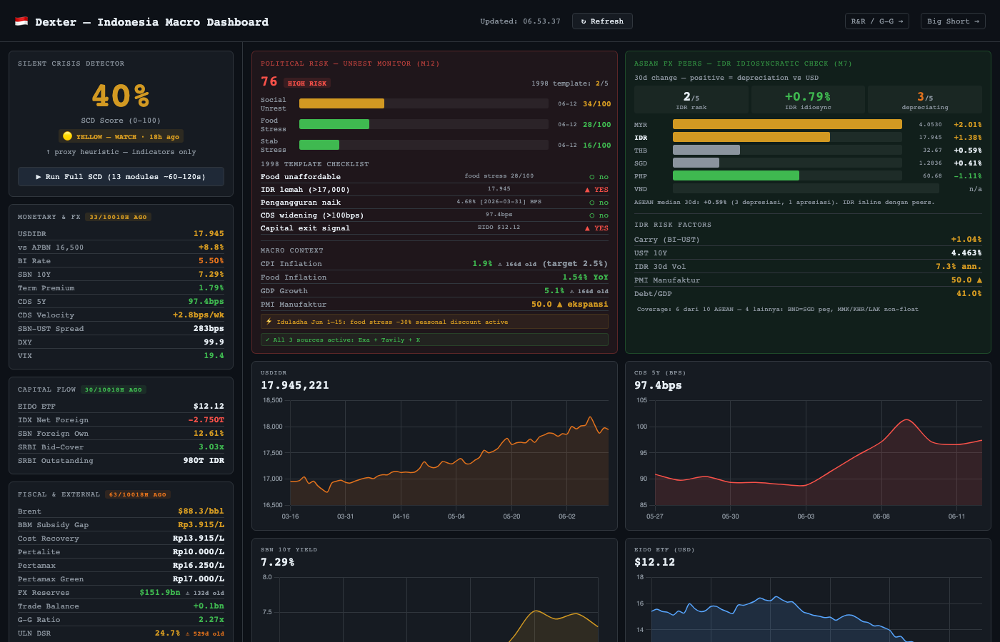
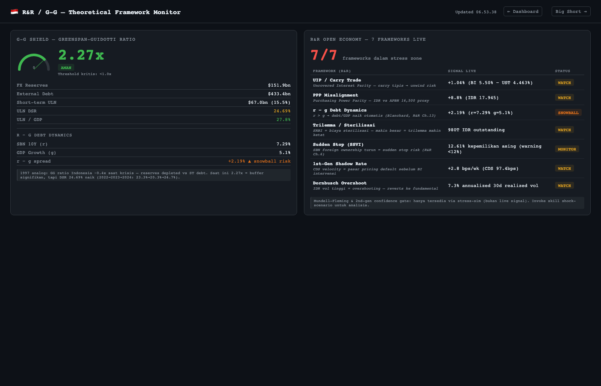
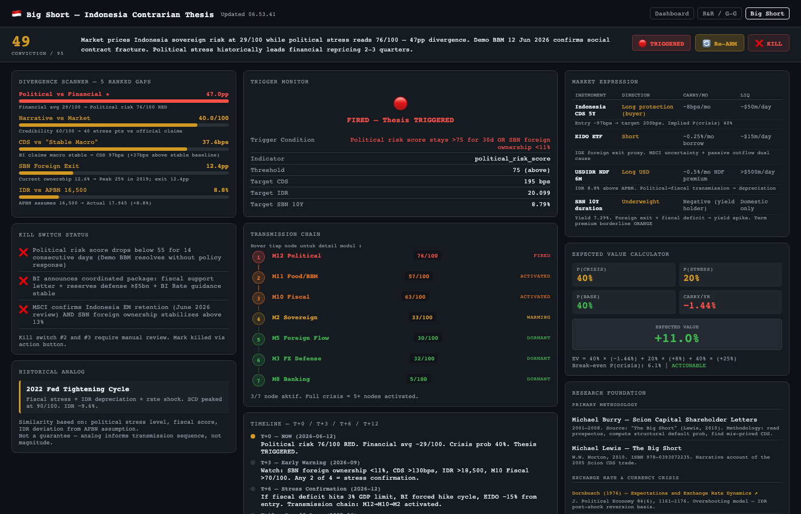

# dex_indonesia 🇮🇩

**Indonesia Sovereign Macro Intelligence System** — fork dari [virattt/dexter](https://github.com/virattt/dexter), dikustomisasi untuk monitoring risiko sovereign Indonesia secara institusional.

> **Tentang fork ini:** Repository ini bukan general-purpose financial agent. Fokus tunggal: deteksi dini krisis sovereign Indonesia sebelum pasar repricing — *Big Short mode* untuk IDR, SBN, dan IHSG. Dan mungkin MBG!


---

## Apa itu Dexter (aslinya)?

Dexter dibuat oleh [@virattt](https://twitter.com/virattt) sebagai autonomous financial research agent — think Claude Code, tapi khusus untuk riset keuangan. Ia bisa decompose pertanyaan finansial kompleks, eksekusi riset bertahap, self-validate, dan iterasi sampai dapat jawaban berbasis data.

**Kemampuan asli Dexter:**
- Task planning otomatis untuk riset keuangan
- Akses real-time: income statement, balance sheet, cash flow
- Self-reflection dan loop detection
- WhatsApp gateway (chat langsung dari HP)
- Eval suite dengan LangSmith tracking

Semua kemampuan asli di atas **tetap ada** di fork ini.

---

## Apa yang ditambahkan di fork ini?

### Big Short Mode — Silent Crisis Detector

13 modul macro intelligence khusus Indonesia, berjalan paralel, agregat ke satu angka: **Silent Crisis Probability (0–100%)**.

```
Silent Crisis Probability: 21%  🟢 GREEN
Synthetic Stability Score: 44/100
Cross-confirmed modules: 1/13
```

| # | Modul | Signal |
|---|-------|--------|
| M1 | BoP | Trade balance, FX reserves, synthetic CAD risk, Greenspan-Guidotti cross-feed |
| M2 | Sovereign Risk | CDS 5Y + velocity (bps/week), SBN yield, foreign SBN %, term premium (ORANGE ≥2%), **BI yield policy flag** (Perry Jun 10 2026; review di era Destry), **S&P interest/revenue proximity risk** (>15% = negative watch; current: 20.4%) |
| M3 | FX Defense | USDIDR z-score, pseudo-stability, BI intervention, **SRBI auction bid-cover** (weekly capital flow proxy — 1wk lead vs DJPPR), 1st/2nd-gen crisis gates |
| M4 | Commodity | Ekspor basket (coal/CPO/nickel/LNG), oil import vulnerability, ICP threshold watch, **B50 biodiesel mandate** (Jul 1 2026 CPO diversion → BoP), **PLN coal DMO compliance** (HBA gap, TDL hike risk) |
| M5 | Foreign Flow | EIDO ETF, silent exit detection, SSVI (Sudden Stop Vulnerability Index), **MSCI EM status** (confirmed Jun 23 2026; Nov 2026 re-review overhang with +3 score-bump at <60d), May 2026 rebalancing outflow |
| M6 | Narrative Divergence | Official guidance vs market — APBN assumptions vs aktual, BBM narrative vs cost recovery |
| M7 | ASEAN Relative Value | IDR idiosyncratic component vs ASEAN peers (supplementary — not in SCD weight) |
| M8 | Banking Stress | NPL (OJK/World Bank API), LDR, CAR, IndONIA corridor (DFR = BI Rate −100bps / LF = BI Rate +75bps), FSAP nexus (implied CAR hit), KLR signals, M2/FX reserves ratio, **BNPL sub-indicator** (OJK IKNB fintech NPL) |
| M9 | Market Stress | IHSG P/E + breadth, valuation disconnect |
| M10 | Fiscal | APBN realisasi vs target, revenue shortfall, deficit trajectory, **S&P interest/revenue threshold** (≥15% = negative action watch; BI hike cycle uplift computed), **MBG burn rate** (Rp 335T = 8.7% APBN, 4× subsidi energi), **BPDPKS biodiesel insentif** (B50 transition cost) |
| M11 | Domestic Pressure | PIHPS 10 komoditas pangan + BBM subsidy gap (Pertalite + Solar B50 MOPS/FAME blended) + ICP threshold watch |
| M12 | Political Risk | Unemployment + **4-signal Exa/Tavily news** (food pressure, social unrest, political stability, **geopolitical_risk** — China drill, democratic backsliding, intl investor concern) + **governance failure** (negara absen, disaster response capacity, separatism/Dayak Borneo) + **X API v2 real-time social feed** (unrest detection, minute-zero) + **PHK/relokasi event tracker** (≥5,000 workers = FDI exit signal). Tavily geopolitical: no domain filter → AFR/SCMP/FT indexed. |
| M13 | ULN / External Debt | DSR (IMF threshold 25%), Greenspan-Guidotti ratio, ULN/GDP, BI hedging compliance (PBI 21/14/2019; BI SULNI Playwright + Exa/Tavily news fallback), 1997 transmission mechanism |

**Logika inti:** Satu modul di RED bisa noise. Dua modul di ORANGE = deteriorasi struktural. Tiga+ = systemic fragility.

### Research Frameworks

**KLR EWS (Kaminsky-Reinhart-Lizondo):**
21-indicator dual crisis signal matrix (12 currency + 9 banking). Threshold-based early warning kalibrasi untuk EM. Includes Module 13 ULN signals: Greenspan-Guidotti ratio (<1.0), DSR (>25%), hedging compliance (<70%). Crisis probability: LOW (0–3 sinyal), MODERATE (4–7), HIGH (8–12), CRITICAL (13+). Invoke via skill `klr-ews`.

**IMF FSAP Sovereign-Bank Nexus:**
SBN yield shock → implied bank CAR erosion: `(sbn_10y − 6.5% baseline) × 6yr duration × 20% SBN/assets`. At +100bps: −1.2pp CAR. Doom loop signal di >1.5pp. Terintegrasi langsung ke Module 8 scoring.

**BI Interest Rate Corridor:**
IndONIA harus stay dalam corridor DFR (BI Rate −100bps) sampai LF Rate (BI Rate +75bps). Spread >30bps = YELLOW, >50bps = ORANGE, >75bps = RED (BI terpaksa inject liquidity = crisis signal).

**Rivera-Batiz & Rivera-Batiz (R&R) — International Finance & Open Economy Macroeconomics:**

Framework teoritis utama yang di-embed ke dalam sistem ini. Setiap sinyal berikut bukan heuristic — ada basis teori makro terbuka yang eksplisit:

| Framework R&R | Chapter | Diimplementasikan di | Sinyal yang dihasilkan |
|---------------|---------|----------------------|------------------------|
| Purchasing Power Parity (PPP) | Ch. 4–5 | Module 6 (Narrative Divergence) | USDIDR vs PPP fair value; Dornbusch overshoot flag |
| Uncovered Interest Parity (UIP) | Ch. 5 | Module 7 (ASEAN RV) | UIP Carry Attractiveness Index: real carry = SBN spread − IDR depreciation. Leads Module 5 foreign flow 2–3 minggu |
| Mundell-Fleming Open Economy | Ch. 8 | Stress Simulator | MBG fiscal shock: ΔG → ΔIDR → term premium → foreign flow (param `fiscalOverrunIdrT`) |
| Dornbusch Overshooting | Ch. 10 | Stress Simulator | IDR shock >15%: short-run overshoot sebelum PPP mean-reversion. Note otomatis di output |
| Trilemma (Mundell) | Ch. 11 | Module 10 (Fiscal) | SRBI sterilization cost: open capital + monetary autonomy → wajib sterilisasi → quasi-fiscal drag BI |
| r-g Debt Dynamics | Ch. 14–16 | Module 13 (ULN) | r−g = SBN 10Y − GDP growth. Jika positif tanpa primary surplus → debt/GDP expands mechanically |
| 1st-gen Crisis (Krugman-FG) | Ch. 12 | Module 3 (FX Defense) | Shadow exchange rate + months-to-attack: GG breach vs SRBI ceiling binding constraint |
| 2nd-gen Self-fulfilling Crisis | Ch. 13 | Module 3 (FX Defense) | Confidence Gate: DC vs AC balance → SAFE / VULNERABLE / ATTACK zone. Upgrades alert to ORANGE if ATTACK |
| Sudden Stop (Calvo) | Ch. 15 | Module 5 (Foreign Flow) | Sudden Stop Vulnerability Index (SSVI): SBN cliff (0.30) + UIP carry (0.25) + EIDO trend (0.25) + GG ratio (0.20) → 0–100, phase low/watch/elevated/imminent |

**Contoh output r-g (Module 13):**
```
### R-G Debt Dynamics (R&R Ch.14–16)
r−g = SBN 10Y 6.71% − GDP growth 5.40% = +1.31pp [KNIFE-EDGE]
Debt/GDP: 27.8% → Primary surplus needed to stabilize: +0.36% GDP
Flag: R-G ADVERSE — without primary surplus, debt/GDP expands mechanically
```

### Shock Scenario Simulator

Forward-looking stress test — simulasi bagaimana satu atau compound shock mengubah seluruh 13 modul sekaligus. Tersedia sebagai CLI script (`scripts/shock-scenario.ts`) maupun skill agent (`shock-scenario`).

```bash
bun scripts/shock-scenario.ts --list          # lihat semua preset
bun scripts/shock-scenario.ts crisis          # 1997/2008 severity analog
bun scripts/shock-scenario.ts idr-freefall    # sudden stop + forced BI hike
bun scripts/shock-scenario.ts moderate        # baseline stress test
# Custom parameter override
bun scripts/shock-scenario.ts moderate --sbn 8.5 --usdidr 21000 --npl 4.5
```

**10 named presets (CLI script):**

| Preset | Deskripsi | SBN Δ | USDIDR Δ | Reserves Δ |
|--------|-----------|-------|----------|------------|
| `mild` | Early deterioration | +50bps | +1,500 | −$20bn |
| `moderate` | Standard stress | +100bps | +3,000 | −$40bn |
| `severe` | Pre-crisis | +150bps | +5,000 | −$60bn |
| `crisis` | 1997/2008 analog | +250bps | +8,000 | −$80bn |
| `trump-tariff` | US tariff shock + EM selloff | +75bps | +2,000 | −$15bn |
| `em-selloff` | Global EM risk-off | +125bps | +4,000 | −$35bn |
| `oil-spike` | Commodity shock + imported inflation | +50bps | +1,000 | −$10bn |
| `idr-freefall` | Sudden stop + forced BI hike | +150bps | +5,000 | −$50bn |
| `bank-crisis` | Credit shock (NPL surge) | +100bps | +2,000 | −$20bn |
| `bi-hike` | Aggressive rate tightening | +200bps | +1,000 | −$5bn |

**3 additional presets (agent skill only — invoke via `shock-scenario` skill, not CLI):**

| Preset | Deskripsi | Primer melalui |
|--------|-----------|----------------|
| `china-slowdown` | China demand shock: coal/CPO/nickel −30%, GG mendekati 1.8, DSR crosses 25% | Step 3H |
| `bi-rate-cut` | Premature BI rate cut −50bps: SBN repricing net +80bps, IDR jatuh +1,200, confidence gate check | Step 3I |
| `sovereign-downgrade` | Rating downgrade ke BB+: CDS +100bps, SBN +125bps, IG-mandate exit ~$19bn, doom loop check | Step 3J |

**Output per scenario:**
- Before vs After score tiap modul (GREEN/YELLOW/ORANGE/RED)
- Transmission chain narrative (doom loop detection, fiscal breach, foreign ownership buffer)
- Silent Crisis Probability: Before → After
- Critical thresholds yang terlewati

**Contoh output (Full Crisis):**
```
## Shock Scenario: Full Crisis
Baseline regime: Q3 — Stagflation (Growth↓ Inflation↑)

| Module         | Before       | After        | Alert Δ       |
|----------------|--------------|--------------|---------------|
| FX Defense     | 32 🟢 GREEN  | 100 🔴 RED   | GREEN→RED     |
| Sovereign Risk | 16 🟢 GREEN  |  97 🔴 RED   | GREEN→RED     |
| Banking Stress |  2 🟢 GREEN  | 100 🔴 RED   | GREEN→RED     |
| Fiscal         | 33 🟡 YELLOW |  55 🟠 ORANGE| YELLOW→ORANGE |

Silent Crisis Probability: 24% 🟢 → 85% 🔴
DOOM LOOP TERRITORY: CAR erosion 3.26pp (threshold >1.5pp)
```

### APBN 2026 Baseline

UU No. 17 Tahun 2025 / Perpres No. 118 Tahun 2025:
- USDIDR: 16,500 | ICP oil: $70/bbl | GDP growth: 5.4% | CPI: 2.5%
- Revenue: 3,154T | Spending: 3,843T | Deficit: 2.68% GDP

**Live deviations (Sep 22, 2026):**
- BI Rate: **5.75%** — hike +25bps Jul 2026 (dipertahankan Jul & Agu RDG); DFR 4.75%, LF 6.50%
- BI Gov: **Destry Damayanti** (dilantik 2 Sep 2026, Keppres 92/P/2026) — pro-stability + pro-growth; GWM rupiah 9%
- **Menkeu: Suahasil Nazara** (dilantik 14 Sep 2026, Keppres 97p/2026) — Menkeu ke-3 era Prabowo (SMI → Purbaya → Suahasil); prioritas: APBN kredibel, defisit <3% PDB, transparansi ALCo
- **APBN Semester I 2026**: Defisit Rp196.5T (0.76% PDB). Subsidi+kompensasi Rp233T (52.1% target). **Outlook full-year: defisit 4.23% GDP** (melampaui 3% constitutional limit per M10 engine Sep 21) — tekanan subsidi energi 247% run-rate vs APBN
- Term premium: **~1.37%** (SBN 10Y 7.120% − BI Rate 5.75%) — YELLOW zone
- S&P interest/revenue ratio: **~20.5%** — 5.5pp above S&P 15% negative-watch threshold 🔴
- USDIDR spot: **~17,875** (melemah dari 17,595 Sep 15; peak 18,032 Agu)
- **CAD Q2 2026: −$12.5B = −3.3% PDB** — melampaui R&R 3% danger zone; BI harus defend via rate hike atau USD sell
- Cadev: **$146.5B** (Agu 2026); DNDF contingent $8B → effective reserves **$138.5B**; CDS 5Y: **81.8bps**; G-G ratio **2.09x**
- Brent: **~$97.2/bbl** (turun dari peak $108.3 Sep 14); margin ke Bahlil $100: **$2.8/bbl** 🔴 ORANGE; Pertalite gap **~Rp5,303/L** 🟠
- BBM: Pertamax Rp15.950 | Pertamax Green Rp19.150 | **Pertalite Rp10,000 + Solar Rp6,800 TIDAK NAIK** (komitmen Bahlil); Solar B50 gap Rp13,514/L 🔴
- **LNG**: JKM spot $28+/MMBtu; Hormuz effectively closed; vessel transits single digit/hari
- **Russia-Indonesia Energy Deal**: Framework MoU ~**150 juta barel** G2G crude oil via **Lemigas** + LPG (Apr–Sep 2026); ESPO API 34–36° = Minas-compatible; "jangan tanya harga" (Bahlil); ESPO discount vs Brent est. ~$10–15/bbl → engine override: `RUSSIA_CRUDE_DISCOUNT_USD` (default 0). Lihat [Russia-Indonesia Energy Deal](#russia-indonesia-energy-deal-2026)
- **Rezim: Q4 Contraction** (Growth↓ Inflation↓) — PMI 49.8 (sub-50); Growth ROC +9.93% accelerating tapi inflation ROC −21.38% deflating
- SCD: **43% 🟡 YELLOW** (naik dari 40% Sep 21) | M12 Political Risk **90/100 🔴** (Dayak Borneo signal, beras El Nino, social unrest 30/30) | M10 Fiscal **71/100 🔴** | M5 Foreign Flow **58/100 🟠** | M3 FX Defense **40/100 🟡** (confidence gate vulnerability zone) | **Thesis #13 ARMED** (polrisk 90>75 + subsidi 247%) — kill switch thresholds final: **KS#3 SBN asing >15%** (current 13.1% tidak fires), **KS#4 harus 6/6** (semua 3 sinyal harus konfirmasi; saat ini 5/6 tidak fires)

### BBM Subsidy Monitoring (Module 11)

Module 11 (Domestic Pressure) tracks domestic fuel prices against cost recovery, computing the subsidy gap that drives fiscal stress and political risk.

**Dua jenis BBM bersubsidi — dua mekanisme subsidi berbeda:**

| BBM | Pump Price | Basis Biaya | Mekanisme Subsidi |
|-----|-----------|-------------|-------------------|
| **Pertalite** (RON 90) | Rp10.000/L | Brent crude → kilang → distribusi | Pertamina/pemerintah: selisih cost recovery − pump |
| **Solar Biosolar** (diesel) | Rp6.800/L | MOPS Gasoil + FAME (CPO biodiesel) | **Dua layer**: (1) Pertamina direct gap + (2) BPDPKS insentif (levy CPO ekspor → subsidi FAME premium) |

Solar bersubsidi lebih kompleks karena blending mandatori biodiesel CPO. B50 mandate (Jul 1 2026) berarti 50% komponen FAME — dan FAME dari CPO **lebih mahal** dari MOPS Gasoil, sehingga total subsidi Solar > Pertalite.

**Regulatory basis:**

| Regulasi | Nomor | Tentang |
|----------|-------|---------|
| Kepmen ESDM | [245.K/MG.01/MEM.M/2022](https://jdih.esdm.go.id/dokumen/view?id=2307) | Formula harga dasar BBM umum (amends Kepmen 62.K/12/MEM/2020) |
| Perpres | 191/2014 jo. 43/2018 | Solar = BBM Jenis Tertentu (subsidized), Rp6.800/L |
| Permen ESDM | B50 2026 | Mandatori biodiesel 50% FAME mulai Jul 1 2026 |
| BPDPKS | Peraturan BPDPKS | Insentif biodiesel = selisih harga FAME vs MOPS, dibiayai levy ekspor CPO |

**Subsidy gap per Sep 15, 2026** (Brent $106.93 + USDIDR 17,595 + CPO $1,117/MT):

| Indikator | Nilai | Alert |
|-----------|-------|-------|
| Pertalite cost recovery | Rp16.567/L | — |
| **Pertalite subsidy gap** | **Rp6.567/L** | 🔴 RED |
| Solar B50 cost recovery (MOPS+FAME blended) | Rp20.413/L | — |
| **Solar B50 subsidy gap (total: direct + BPDPKS)** | **Rp13.613/L** | 🔴 RED |

Solar gap **2.7× lebih besar** dari Pertalite — tapi selama ini tidak tertrack karena BPDPKS diperlakukan sebagai subsidi terpisah.

**Harga BBM terkini (Sep 2026):**

| Jenis | Harga | Tipe | Keterangan |
|-------|-------|------|------------|
| Pertalite (RON 90) | IDR 10.000/liter | Bersubsidi | Tidak berubah sejak Sep 2022 — dilindungi komitmen Bahlil |
| Solar / Biosolar (B50) | IDR 6.800/liter | Bersubsidi | Mandate B50 Jul 1 2026; pump price **tidak berubah** tapi cost recovery naik ke Rp20.080/L (gap Rp13.280/L 🔴) |
| Pertamax (RON 92) | IDR 15.950/liter | Non-subsidi | Rollback 1 Agu 2026 dari Rp16.250 (hike Jun 10 dibatalkan) |
| Pertamax Green (RON 95) | IDR 19.150/liter | Non-subsidi | **+Rp2.550 efektif 2 Sep 2026** (dari 16.600); hike nonsubsidi Sep 2026 |
| Pertamax Turbo (RON 98) | IDR 19.600/liter | Non-subsidi | **+Rp650 efektif 1–2 Sep 2026** (dari 20.750 Jun → 19.600 Sep) |
| Dexlite (CN 51) | IDR 23.700/liter | Non-subsidi | **Naik Sep 2026**; solar diesel non-subsidi; sangat sensitif krisis Hormuz |
| Pertamina Dex (CN 53) | IDR 25.200/liter | Non-subsidi | **Naik Sep 2026**; solar diesel premium mesin high-performance |

**Bahlil Statement — Verbatim Record:**


> *"Saya sampaikan kepada publik, bahwa insyaallah stok kita di atas standar minimum, baik itu solar, baik itu bensin, maupun LPG. Insyaallah aman, dan sekali lagi saya katakan bahwa kami sudah bersepakat atas arahan Bapak Presiden, bahwa harga BBM untuk subsidi tidak akan dinaikkan sampai dengan akhir tahun."*
>
> *"Doain, ini kan tergantung dengan harga ICP, tapi kalau sampai dengan 100 dolar itu sudah aman BBM. Dan sekarang harga rata-rata ICP Januari sampai dengan sekarang itu tidak lebih dari USD77."*
>
> — Menteri ESDM **Bahlil Lahadalia**, Istana Negara Jakarta, **16 April 2026**
> Sumber: [ESDM.go.id](https://www.esdm.go.id/id/media-center/arsip-berita/menteri-bahlil-harga-bbm-subsidi-tak-naik-hingga-akhir-tahun) | [Tempo.co](https://www.tempo.co/ekonomi/alasan-harga-bbm-subsidi-tidak-naik-hingga-akhir-2026-2129627) | [Tribun Jateng](https://jateng.tribunnews.com/nasional/1253476/ternyata-ini-syarat-agar-harga-bbm-subsidi-dan-elpiji-tidak-naik-bahlil-enggak-gampang)

**Konteks keputusan:** Arahan Presiden Prabowo Subianto pasca kunjungan ke Rusia dan Prancis. Indonesia memiliki production deficit ~1 juta bbl/hari (konsumsi 1,6M bbl/hari vs produksi domestik 600–610k bbl/hari) — sangat rentan terhadap shock harga global.

**Kondisi komitmen (hard clause):**
- ICP ≤ $100/bbl → BBM subsidi **tidak naik**
- ICP > $100/bbl → komitmen **gugur** — hike menjadi keharusan fiskal
- ICP YTD rata-rata Jan–Apr 2026: $77/bbl (saat pernyataan dibuat, margin $23)
- **Per 10 Juni 2026: Brent $92.6 — margin tersisa hanya $7.4/bbl** ⚠️ (BI Rate inter-cycle hike + Pertamax naik 32% dalam satu hari)
- **Per 14 Sep 2026: Brent $108.3 → ICP melewati $100 🔴 THRESHOLD TERLAMPAUI** — komitmen secara fiskal gugur; ICP YTD Jan-Sep rata-rata $85-90/bbl (masih "aman" rata-rata, tapi spot sudah jauh di atas); Bahlil **retoris mempertahankan** komitmen ("tidak naik sampai 31 Des, berapa pun harganya"), tapi beban subsidi+kompensasi semester I sudah Rp233T (52.1% target); Saudi East-West pipeline offline memperparah outlook
- **Per 15 Sep 2026: Brent $106.93** — tetap di atas $100; war risk insurance Hormuz 3–10% hull value; GCC-Iran talks postponed; tekanan fiskal berkelanjutan

---

**Hormuz 2026 — Situation Report (SitRep)**

*Sumber utama: [Wikipedia: 2026 Strait of Hormuz crisis](https://en.wikipedia.org/wiki/2026_Strait_of_Hormuz_crisis) | [CNBC: Iran vows to completely block Hormuz](https://www.cnbc.com/2026/06/01/iran-us-negotiations-strait-of-hormuz.html) | [Al Jazeera](https://www.aljazeera.com/news/2026/6/5/how-the-us-naval-blockade-has-bled-iran-of-nearly-6bn-in-oil-revenues) | [Britannica](https://www.britannica.com/event/2026-Iran-war)*

| Tanggal | Event |
|---------|-------|
| **28 Feb 2026** | US-Israel luncurkan Operation Epic Fury; serangan terhadap fasilitas militer & nuklir Iran; Khamenei tewas |
| **1–4 Mar 2026** | IRGC mulai blokade; kapal tanker *Skylight* diserang; IRGC klaim kontrol penuh 4 Mar |
| **8 Mar 2026** | Brent tembus **$100/bbl** untuk pertama kali dalam 4 tahun; peak $126/bbl |
| **19 Mar 2026** | Dubai crude record **$166/bbl** — kenaikan bulanan terbesar dalam sejarah |
| **27 Mar 2026** | IRGC umumkan penutupan selat untuk kapal menuju/dari pelabuhan AS, Israel, dan sekutu |
| **8 Apr 2026** | Gencatan senjata sementara; Iran mulai pungut **toll >$1 juta/kapal** |
| **13–29 Apr 2026** | US Navy implementasi counter-blockade pelabuhan Iran |
| **4 Mei 2026** | Operation Project Freedom: US Navy kawal kapal dagang; di-pause 6 Mei |
| **1 Jun 2026** | Iran hentikan negosiasi dengan AS; **vow to completely block Hormuz** |
| **9 Jun 2026** | Status: ~5% traffic normal (~600 tanker tertahan di Teluk Persia, 240+ menunggu di luar) |
| **~Jun–Jul 2026** | US-Iran MoU 60 hari ditandatangani; flow sempat meningkat hampir 3× sebelum deadline |
| **17 Agu 2026** | Traffic Hormuz **jatuh ke single digit** vessel/hari; deadline MoU mendekat |
| **19 Agu 2026** | **MoU 60 hari berakhir** — pasar berhenti menunggu; Kpler: "market stopped waiting for Hormuz" |
| **20 Agu 2026** | Brent **naik ~3%** saat AS perkuat tekanan terhadap Iran pasca-MoU expired; oil surge di The National |
| **22 Agu 2026** | Status: Hormuz effectively closed; Iran kehilangan kontrol signifikan (CNN Agu 18); Brent **$94.4/bbl** |
| **Sep 8 2026** | Brent **$96.3/bbl** — ICP margin ke Bahlil $100 tersisa **$3.7/bbl**; IDR 17,635; Pertalite gap Rp4,951/L 🟠 |
| **Sep 14 2026** | Serangan baru terhadap Arab Saudi & kapal di Teluk Persia; Brent **$108.3/bbl** (naik +2.8% Asia session); ICP **melewati $100** — komitmen Bahlil gugur; Pertalite gap **Rp6,781/L** 🔴; Menkeu Suahasil dilantik; BBM langka Sulsel/Jawa/Sumatra; GCC-Iran talks postponed |
| **Sep 15 2026** | Brent **$106.93/bbl** (turun 1.18% dari $108.3 puncak 14 Sep); Saudi East-West pipeline masih offline; Houthi luncurkan serangan baru ke Arab Saudi; JKM LNG spot **$28+/MMBtu** (tertinggi 2.5 tahun); Bahlil tegaskan ulang komitmen Pertalite+Solar tidak naik 31 Des; APBN data Jul-Agu pending (Suahasil janji ALCo) |

**Dampak global:**

| Metric | Data |
|--------|------|
| Pra-krisis (baseline) | Brent ~$70–80/bbl |
| Peak Brent | **$126/bbl** (Mar 2026) |
| Peak Dubai crude | **$166/bbl** (19 Mar 2026) |
| Penurunan traffic | 70% dalam 48 jam pertama → ~0% saat ini |
| Ekspor regional turun | 60% (dari 25M ke ~10M bbl/hari) |
| Kapal tertahan | 20.000 pelaut + 2.000 kapal di Teluk Persia (per 21 Apr) |
| LNG Eropa | €30 → €60+/MWh |

Sebelum krisis: **25% seaborne oil** + **20% LNG dunia** melewati Hormuz. Kapasitas pipeline alternatif ~9M bbl/hari — tidak cukup menggantikan 20M bbl/hari via Hormuz.

**Implikasi langsung untuk Indonesia:**

| Skenario | Brent | ICP Proxy | Subsidy Gap/Liter | ICP Alert | Action |
|----------|-------|-----------|-------------------|-----------|--------|
| Baseline APBN | $70 | $70 | ~IDR 0 | 🟢 GREEN | Tidak ada |
| Saat ini (Sep 15) | **$106.93** | ~$106.93 | **IDR 6.413** | 🔴 RED | ICP melewati $100 — komitmen Bahlil dipertahankan retoris tapi fiskal tertekan; Saudi pipeline offline; volatilitas tinggi |
| Threshold Bahlil | $100 | $100 | ~IDR 7.200 | 🔴 RED | Komitmen gugur |
| Peak Mar 2026 | $126 | $126 | ~IDR 12.800 | 🔴 RED | Hike wajib fiskal |
| Eskalasi baru | $110+ | $110+ | ~IDR 9.000+ | 🔴 RED | Hike + social unrest |

**⚠️ UPDATE — TEREALISASI (Sep 14–15 2026):** Iran pada 1 Juni 2026 menghentikan negosiasi dan mengumumkan akan menutup penuh Hormuz. **Skenario yang sebelumnya forward-looking ini kini terjadi:** Brent $106–108/bbl (Sep 14–15) → ICP **melewati $100** → komitmen Bahlil secara fiskal gugur → BBM langka Sulsel/Jawa/Sumatra → M12 political risk 79/100 🔴. Yang belum terjadi: hike BBM resmi (Bahlil masih pertahankan komitmen verbal). Risiko residual: eskalasi ke $110–120 (Saudi pipeline offline + Houthi aktif) → memaksa hike atau defisit meledak.

**Cost recovery formula:**
```
cost_recovery (IDR/liter) = (Brent_USD / 158.987) × USDIDR × 1.40
```
Faktor 1.40 = crude 100% + kilang 20% + distribusi 10% + margin+pajak 10%

**Alert thresholds (ICP):**
- GREEN: ICP < $80/bbl
- YELLOW: $80–90/bbl (Hormuz risk zone)
- ORANGE: $90–100/bbl (approaching commitment threshold)
- RED: > $100/bbl — **APBN commitment breaking point, hike imminent**

**Alert thresholds (subsidy gap per liter):**
- GREEN: gap < IDR 2.000
- YELLOW: IDR 2.000–4.000 (burden building)
- ORANGE: IDR 4.000–7.000 (analogous to mid-2022 sebelum hike Sep 2022)
- RED: > IDR 7.000 (hike imminent — fiscal tidak tahan)

**Emergency override (tanpa redeploy):**
Jika pemerintah umumkan kenaikan harga BBM, update langsung via env var:
```bash
# .env — BBM price overrides (no redeploy needed)
PERTALITE_PRICE_IDR=10000     # subsidi — tidak berubah per Sep 2026
SOLAR_PRICE_IDR=6800          # subsidi — tidak berubah
PERTAMAX_PRICE_IDR=15950      # RON 92 — rollback 1 Agu 2026 dari Rp16.250
PERTAMAX_GREEN_PRICE_IDR=19150  # RON 95 — naik 2 Sep 2026 dari Rp16.600 (+Rp2.550)

# .env — policy/classification signals (operator-updated qualitative flags)
BI_BUYS_LONG_SBN=false        # Perry Warjiyo statement 10 Jun 2026 — review ulang di era Destry
MSCI_CLASSIFICATION_STATUS=under_review   # Nov 2026 re-review overhang
MSCI_MAY2026_REBALANCING_OUTFLOW_USD_BN=1.8  # passive outflow rebalancing Mei 2026
BI_GOVERNOR_VACANT=false      # Destry Damayanti dilantik 2 Sep 2026 (Keppres 92/P/2026)
```
Sistem akan otomatis rekalkulasi subsidy gap, ICP alert, dan foreign flow risk score menggunakan nilai terbaru.

### Game Theory — Strategic Behavior Engine

> Ref lengkap: [`docs/GAME_THEORY_KAJIAN.md`](docs/GAME_THEORY_KAJIAN.md) — serial 20-tweet + data gap table + roadmap.

SCD bukan hanya agregasi statistik — beberapa modul mengimplementasikan **logika strategic behavior** di mana output satu aktor berinteraksi dengan belief/aksi aktor lain. Sep 2026: **GT coverage ~51%** (naik dari 35% pre-P1/P2/P3 commit).

#### Peta implementasi (6 konsep, 5 status)

```
┌─────────────────────────────────────────────────────────────────────┐
│            GAME THEORY COVERAGE — Dexter Sep 2026 (~51%)           │
├────────────────────┬──────────┬──────────┬──────────────────────────┤
│ Konsep             │ Modul    │ Status   │ Output Signal            │
├────────────────────┼──────────┼──────────┼──────────────────────────┤
│ Morris-Shin 2nd-   │ M3 FX    │ ✅ ~85%  │ Confidence Gate:         │
│ gen self-fulfilling│ Defense  │          │ SAFE/VULNERABLE/ATTACK   │
│ crisis             │          │          │ DC vs AC balance         │
├────────────────────┼──────────┼──────────┼──────────────────────────┤
│ Krugman/Flood-     │ M3 FX    │ ✅ ~80%  │ Shadow exchange rate,    │
│ Garber 1st-gen     │ Defense  │          │ months-to-attack counter │
│ (reserve collapse) │          │          │                          │
├────────────────────┼──────────┼──────────┼──────────────────────────┤
│ Barro-Gordon time  │ M10      │ ✅ NEW   │ credibilityIndex 0–100,  │
│ inconsistency      │ Fiscal   │ (Sep 15) │ regime: committed /      │
│ (Barro-Gordon 1983)│          │          │ watch / strained /       │
│                    │          │          │ discretionary; +bump M10 │
├────────────────────┼──────────┼──────────┼──────────────────────────┤
│ Diamond-Dybvig     │ M8       │ ✅ NEW   │ runCoordinationScore,    │
│ bank run           │ Banking  │ (Sep 15) │ 5-condition matrix;      │
│ coordination       │ Stress   │          │ low/watch/elevated/      │
│ (D-D 1983)         │          │          │ critical; +bump M8       │
├────────────────────┼──────────┼──────────┼──────────────────────────┤
│ De Long/Shleifer   │ M5       │ ✅ NEW   │ EIDO autocorrelation     │
│ herding cascade    │ Foreign  │ (Sep 15) │ (lag-1 Pearson 10d+21d), │
│ (momentum traders) │ Flow     │          │ cascadeScore; MSCI       │
│                    │          │          │ amplifier +15 if review  │
├────────────────────┼──────────┼──────────┼──────────────────────────┤
│ Sobel cheap-talk / │ M6       │ ✅ NEW   │ Bayesian posterior       │
│ Bayesian credibility│ Narrative│ (Sep 15) │ P(BI credible|data),    │
│ (Sobel 1985)       │ Divergence│         │ persisted via DB series  │
├────────────────────┼──────────┼──────────┼──────────────────────────┤
│ SCD strategic      │ SCD      │ ✅ NEW   │ Convex escalation coeff: │
│ complementarity    │ aggregator│(Sep 15) │ each extra RED module    │
│ (Schelling/Cooper- │          │          │ has increasing marginal  │
│ John)              │          │          │ contribution; cap 1.70×  │
├────────────────────┼──────────┼──────────┼──────────────────────────┤
│ 3rd-gen balance    │ M8+M13+  │ 🔵 ROADMAP│ Currency mismatch +     │
│ sheet amplifier    │ M3 unified│         │ FX hedging ratio;        │
│                    │          │          │ butuh SULNI FX-hedging   │
├────────────────────┼──────────┼──────────┼──────────────────────────┤
│ Political economy  │ M12      │ 🔵 ROADMAP│ Veto player mapping,     │
│ (Drazen/Tabellini) │ Political │          │ payoff matrix per isu;   │
│                    │ Risk      │          │ butuh Poltracking series │
└────────────────────┴──────────┴──────────┴──────────────────────────┘
```

#### Detail implementasi per konsep

**Morris-Shin Confidence Gate (M3 — ~85% complete)**

Self-fulfilling currency attack model. BI menyerah bukan karena cadangan habis, tapi karena cukup spekulan *percaya* BI akan menyerah → menyerah jadi rasional.

```
DC Index = f(BI rate sacrifice, growth cost, reserve runway)
AC Index = f(ULN dollarisasi shock, inflasi passthrough, credibility loss)

Zone mapping:
  DC − AC > +20  →  ATTACK zone 🔴   (spekulasi rasional)
  DC − AC ±20    →  VULNERABLE 🟠    (multiple equilibria)
  DC − AC < −20  →  SAFE 🟢
```

**Krugman/Flood-Garber Shadow Rate (M3 — ~80% complete)**

1st-gen: serangan terjadi saat cadangan mencapai level kritis — bukan saat habis. Output: `months_to_attack` + implied USDIDR saat collapse.

**Barro-Gordon Time Inconsistency (M10 — implementasi baru Sep 15)**

Post-reshuffle Suahasil Nazara = credibility building dari nol. 4-signal credibility index:

```
credibilityIndex = subsidyPressure×0.35 + deficitBreachRisk×0.25
                 + marketCredibilityCost×0.25 + fiscalSpaceTight×0.15

Regime:
  CI ≥ 70  →  discretionary  (komitmen fiskal tidak dipercaya pasar)
  CI ≥ 50  →  strained
  CI ≥ 30  →  watch
  CI < 30  →  committed

Score bump ke M10: +CI×0.12 (max +12 di CI=100)
Sep 15 2026: CI = 63/100, regime = STRAINED
```

**Diamond-Dybvig Bank Run Coordination (M8 — implementasi baru Sep 15)**

Panic equilibrium jadi rational jika ≥3/5 kondisi terpenuhi:

```
c1: NPL > 3.5%          (saat ini: 2.1% ✗)
c2: LDR > 92%           (saat ini: 84.0% ✗)
c3: IndONIA spread > 40bps
c4: Fintech NPL > 5% AND tumbuh > 10% YoY  (saat ini: 5.0% ⚠)
c5: Implied CAR erosion > 0.8pp (saat ini: ~0.8pp ⚠)

runCoordinationScore: 15/35/60/85 di 1/2/3/4+ conditions
Score bump ke M8: +runCoordinationScore×0.15
Sep 15 2026: 2/5 conditions → watch, skor 35
```

**De Long/Shleifer Herding Cascade (M5 — implementasi baru Sep 15)**

Momentum trader cascade dari EIDO price autocorrelation:

```
autocorr1(EIDO 10d + 21d)  →  cascade risk low/watch/elevated/critical
MSCI under_review/downgrade_risk  →  passive amplifier +15 cascade score
Score bump ke M5: cascadeScore×0.15
```

**Schelling/Cooper-John Strategic Complementarity (SCD — implementasi baru Sep 15)**

SCD amplifier diganti dari step function ke **convex escalation**:

```
Sebelumnya: 5+ modul RED → multiplier 1.40× (flat)
Sekarang:   modul ke-N memberikan kontribusi marginal meningkat
            cap 1.70× di 7+ modul RED
```

Artinya: modul ke-6 RED lebih "berat" dari modul ke-3 RED — mencerminkan bahwa krisis sistemik non-linear (satu krisis trigger krisis lain).

#### Roadmap GT coverage

```
Sep 2026  ██████████░░░░░░░░░░  ~51%  (selesai: MS + KFG + BG + DD + DLS + SCC + Bayesian)
Des 2026  ████████████░░░░░░░░  ~54%  (target: 3rd-gen balance sheet — SULNI FX-hedging)
Jun 2027  ██████████████░░░░░░  ~59%  (target: PolEcon M12 — Poltracking series)
Sep 2027  ████████████████░░░░  ~63%  (target: Bayesian M6 full calibration dari 6 krisis)
```

**Yang tersisa untuk ~63%:**
- **3rd-gen balance sheet** (`M8+M13+M3 unified`) — butuh SULNI quarterly FX-hedging ratio per korporasi. Data ada tapi baru per Q-release, ~6wk lag.
- **Political economy payoff matrix** (`M12`) — veto player mapping + Poltracking time series. Butuh political science input atau API Poltracking Indonesia.
- **Bayesian M6 full calibration** — likelihood functions P(data|credible) vs P(data|not_credible) dikalibrasi dari 6 krisis historis (data backtest sudah ada di `backtest/crisis-calendar.ts`). Currently pakai heuristic prior, bukan proper posterior dari empirical base rate.

### 4-Level Belief Stack (Haye Thread — Oil Price Epistemics)

Bahlil bilang $77 (April) → ICP $107 live (Sep 15). APBN pasang $70. Empat angka, satu komoditas — mana yang dipercaya? Framework "Belief Stack" di dashboard `/bs` menyusun empat lapisan **keyakinan yang beda-beda tentang harga minyak yang sama**, dari yang paling dogmatis (angka anggaran) sampai paling struktural (floor Dubai + refining premium). Jarak antar-lapis = ukuran narrative divergence; kalau semua lapis konvergen tinggi = mainstream harus revise turun, kalau semua konvergen rendah = mainstream harus revise naik. Dispersi tinggi = coordination attack risk (Morris-Shin). **Sep 15 2026 status**: L1=$70 vs L3≈$107 → gap $37 (CV% sangat tinggi, HIGH DISPERSION territory) — semua empat lapis konvergen TINGGI; APBN assumption sudah tidak relevan sebagai anchor fiskal realistis.

| Level | Angka | Sumber | Sifat | Alert threshold |
|-------|-------|--------|-------|-----------------|
| **L1 — APBN Official** | $70/bbl | UU APBN 2026 (ICP assumption) | **Static** — patokan legal, tidak berubah tanpa APBN-P | fixed anchor |
| **L2 — Stale Analyst Consensus** | $80/bbl¹ | INDEF-style proxy (bukan riil-time) | **Static anchor** — di-hardcode sebagai "baseline worst-case konsensus lama"; bukan angka live; konsensus riil Sep 2026 sudah >>$100 tapi L2 di sini adalah floor referensi untuk CV% calc | yellow anchor |
| **L3 — ICP Actual (Brent proxy)** | *live* | `brent_price_usd` (Yahoo BZ=F) | **Dynamic** — updated harian | `>80` yellow · `>90` orange · `>100` red |
| **L4 — Structural Floor (Dubai+$20)** | *live* | `dubai_crude_spot_usd + $20` (refining+distribusi premium empiris) | **Dynamic** — updated harian | `>90` yellow · `>110` orange · `>120` red |

**Logika 4 lapis:**
- **L1 vs L3** — narrative divergence pemerintah vs realitas pasar (fiskal). Kalau L3 > L1 sustained → subsidy overrun mekanis; APBN assumption bocor.
- **L1 vs L4** — narrative divergence pemerintah vs realitas fisik. L4 hitung harga *sampai ke pengguna* (Dubai spot + biaya refining). L4 > L3 = crude tersembunyi lebih mahal karena bottleneck kilang / logistik.
- **L2 vs L3/L4** — konsensus analis yang stale vs data live. L2 tidak boleh dipercaya di kondisi Hormuz aktif.
- **Bahlil threshold** $100/bbl bekerja di L3 (ICP). **Sep 2026: L3 sudah $107, L4 (Dubai ~$87+$20=$107) juga melampaui threshold** — semua lapis di atas $100; kondisi sebelumnya "L4 sering menembus duluan" kini irrelevant karena keduanya sudah lampaui. Concern saat ini: apakah L3 bisa turun ke bawah $100 sebelum APBN-P diperlukan.

**Yang dinamis** di panel Belief Stack live:
- **L3, L4**, gap vs L1 (`bGap`, `dGap`), alert kelas (`green→red`)
- **Brent–Dubai spread** (Hormuz proxy) — `<$3` normal · `$3-7` elevated · `$7-10` HIGH · `>$10` EXTREME (Dubai > Brent = Hormuz premium — physical shortage sinyal)
- **Morris-Shin CV%** — koefisien variasi dari L1+L2+L3+L4. `>25%` HIGH DISPERSION (threshold region), `>15%` ELEVATED (coordination risk), `>8%` MODERATE. High CV = signal precision rendah → serangan koordinasi self-fulfilling. Disclosure mendadak → CV collapse → CDS discontinuous jump (Morris & Shin 2004).

**Yang statis** di panel (angka referensi, update manual saat BPS/Kemenkeu rilis baru):
- BPS Impor Migas 2025 = $32.77B (crude 28%, refined+LPG 72%)
- 2026 run-rate = $38.8B (+49% YoY)
- Apr 2026 YoY: +82.5% (crude +67%, refined +88%)
- APBN Subsidi BBM+LPG target = Rp 105.4T; **realisasi Semester I = subsidi Rp116.9T + kompensasi Rp116T = Rp233T total (52.1% of combined subsidi+kompensasi target, laju 2× pro-rata)**; Q1 realisasi lama: Rp118.7T (+266% over pro-rata — sekarang digantikan data Sem-I)

**Kenapa 4 (bukan 3, bukan 5):**
- 3 lapis (APBN/consensus/live) melewatkan **structural floor** — narrative bisa tembus L3 sebelum L4, dan L4 justru anchor yang paling tahan intervensi (Dubai fisik susah di-manipulasi).
- 5 lapis (tambah forward curve atau options-implied) menambah noise tanpa signal — futures Brent 12M lag terlalu jauh untuk kill switch.
- 4 lapis = **2 static anchors + 2 dynamic reads** = cukup untuk CV% jadi meaningful (n≥3 syarat), tidak cukup untuk overweight satu tipe (2:2 balance).

**Interpretasi cepat:**
- L4 < L1: over-anchored, mainstream terlalu bearish — reflasi risiko
- L1 < L3 < L4: normal — market di antara anchor & floor
- L3 > L4 + spread negatif: Hormuz premium — physical shortage
- CV% > 25%: pasar tidak sepakat harga wajar — coordination attack setup

---

### Russia-Indonesia Energy Deal (2026)

*G2G minyak mentah Rusia — diversifikasi pasokan impor di tengah Hormuz crisis + komitmen Bahlil $100/bbl.*

| Tanggal | Event |
|---------|-------|
| **~Apr 2026** | Prabowo kunjungi Moskow — bilateral dengan Putin; energy security masuk agenda utama (konteks: Hormuz krisis sudah aktif sejak 28 Feb, ICP naik ke $77+ YTD) |
| **16 Apr 2026** | Bahlil statement BBM tidak naik — "pasca kunjungan ke Rusia dan Prancis" (verbatim); konfirmasi energy diplomasi sedang berjalan; margin ke $100 saat itu $23/bbl |
| **Mei–Jul 2026** | Bahlil serangkaian kunjungan ke Moskow; negosiasi volume, jalur distribusi, mekanisme pembayaran alternatif (IDR/RUB swap atau barter) |
| **~Jul–Agu 2026** | Framework MoU disepakati: **150 juta barel** crude G2G via **Lemigas** + LPG inclusion. Pricing tidak dipublikasikan |
| **Sep 2026** | Pertemuan bilateral Prabowo-Putin kedua; deal dikonfirmasi. Bahlil: **"jangan tanya harga"** — komersial sensitivity + secondary sanctions concern |

**Deal structure:**

| Parameter | Detail |
|-----------|--------|
| **Crude spec** | ESPO Blend (API 34–36°, sulfur ~0.5–0.6%) |
| **Refinery compatibility** | ✅ Compatible — ESPO API 34° ≈ Minas/Duri (API 34°); Balongan + Cilacap siap proses tanpa upgrade |
| **Vehicle** | Lemigas (Puslitbang Teknologi Minyak & Gas ESDM) — G2G channel, bukan Pertamina langsung. Buffers secondary sanctions risk |
| **Volume** | ~150 juta barel total framework; ~65–70% total impor crude Indonesia selama ~7–8 bulan (konsumsi ~600–650k bbl/hari) |
| **LPG** | Included — mengurangi exposure ke LPG Qatar via Hormuz (JKM $28+/MMBtu Sep 2026) |
| **Pricing** | Tidak dipublikasikan. Est. ESPO discount vs Brent: **~$10–15/bbl** (historical Asia ESPO spread). Bahlil refuse to confirm |
| **Payment** | Tidak dikonfirmasi; kemungkinan IDR/RUB swap atau barter (batubara/CPO/nikel) — menghindari USD SWIFT clearing |

**Dampak ke engine Dexter:**

| Engine | Dampak | Status engine saat ini |
|--------|--------|------------------------|
| **M11 `computeCostRecovery()`** | Formula Brent-based **overstates subsidi gap** ~Rp485–975/L jika deal 25–50% of supply. Gap Rp6.413/L (Sep 15) adalah ceiling — aktual sedikit lebih rendah jika ESPO delivery terealisasi | Env var `RUSSIA_CRUDE_DISCOUNT_USD` tersedia (default 0 = conservative). Set 3.1 (25% supply) atau 6.25 (50%) saat delivery terkonfirmasi |
| **M10 Subsidi run-rate (247%)** | Slight overstate jika Russia discount material — mungkin aktual 235–240% bukan 247% | Akan terkoreksi otomatis saat `RUSSIA_CRUDE_DISCOUNT_USD` diset |
| **M6 Narrative** | "Jangan tanya harga" = **opacity signal** — pemerintah sadar selisih vs Brent tapi tidak akui. Melemahkan akuntabilitas fiskal → divergence score bertahan | Treated as narrative divergence check #9 amplifier |
| **M12 Geopolitical** | Prabowo-Putin 2× + Lemigas vehicle = Indonesia non-aligned aktif; concern institutional EM investors (EU-aligned + ESG funds) | `geopolitical_risk` sub-signal diperkuat |
| **M5 Foreign Flow** | Russia alignment bisa trigger ESG/sanctions-concern screen dari Western fund; partially offset oleh MSCI EM CONFIRMED Jun 23 | Monitor EIDO autocorrelation (herding cascade signal) pasca-deal announcement |
| **M4 Commodity** | Deal **mengurangi Hormuz exposure** untuk portion crude yang di-supply via ESPO; tapi tidak eliminasi — 50–75% impor sisanya masih exposed | `oil_vulnerability_score` harus dicatat dengan caveat jika ESPO volume material |

**Engine override (update di `.env` saat delivery terkonfirmasi):**

```bash
# G2G Russia ESPO crude discount — blended (accounting for Russia share of total imports)
# ESPO discount vs Brent: ~$10–15/bbl (Asia market historical). Russia supply fraction: 25–50% est.
# Blended impact: 0.25 × $12.5 = ~$3.1/bbl (conservative) → $6.25/bbl (50% aggressive)
# Reduces bbm_subsidy_gap_idr_liter by ~Rp485–975/L at current Brent+USDIDR.
# Default: 0 (no confirmed delivery volume). Update saat Lemigas/ESDM konfirmasi bulk delivery.
# RUSSIA_CRUDE_DISCOUNT_USD=3.1    # blended $/bbl — conservative (25% supply share)
# RUSSIA_CRUDE_DISCOUNT_USD=6.25   # blended $/bbl — aggressive (50% supply share)
```

**⚠️ Caveat:** Deal ini framework MoU — realisasi bergantung pada:
1. **Secondary sanctions** — Lemigas buffer, tapi risiko residual tetap ada (US OFAC non-binding tapi market-moving)
2. **Shipping/insurance** — ESPO route (Kozmino → Asia) tidak via Hormuz ✅; tapi war risk premium + P&I club coverage
3. **Payment mechanism** — USD clearing alternative (IDR/RUB swap, barter) masih dalam finalisasi → execution risk
4. **Volume timeline** — 150 juta barel adalah total framework, bukan bulanan; pace delivery belum dikonfirmasi publik

---

### Scripts Tambahan

```bash
bun scripts/morning-check.ts              # morning brief semua 13 modul
bun scripts/shock-scenario.ts --list      # lihat semua preset scenario
bun scripts/shock-scenario.ts crisis      # full crisis simulation (1997/2008 analog)
bun scripts/shock-scenario.ts idr-freefall # sudden stop + forced BI hike cycle
bun scripts/seed-banking-baseline.ts      # seed CAR/LDR dari OJK LSPI (quarterly)
bun scripts/refresh-monthly-data.ts       # manual trigger: CPI/GDP/cadev/PMI/ULN/unemployment/subsidi/CPO → DB (cron tgl 8)
bun scripts/brent-alert.ts               # cek Brent vs BRENT_ALERT_THRESHOLD ($99 default) → macOS notif; crontab 4h
bun scripts/scd-alert.ts                 # cek SCD score vs macro_scores DB → notif jika ≥75% atau ≥3 RED; crontab 08:30 WIB
bun scripts/msci-countdown.ts            # countdown MSCI Nov 12 2026 review → notif T-60/T-30/T-7/T-0; crontab 08:00 WIB
bun scripts/health-check.ts              # freshness audit semua indikator; exit 1 jika ada RED-tier gap
bash env-check.sh                        # live ping semua API key di .env
```

**Freshness gates (Dexter Eval Sep 14, 2026):** engine M1/M2/M3/M5/M7/M8/M9/M13 emit `DATA STALE` flag dan `LOW CONFIDENCE` banner otomatis kalau input critical ORANGE/RED-stale — mencegah false-GREEN score dari scraper yang diam-diam gagal. Coverage per modul:

| Modul | Gate indikator | RED threshold |
|---|---|---|
| M1 BoP | `trade_balance_bn`, `current_account_pct_gdp_quarterly`, `imports_bn` | >90d / >180d / >90d |
| M2 Sovereign | `indonesia_cds_5y_bps`, `sbn_10y_yield_pct` | >14d |
| M3 FX Defense | `srbi_bid_cover_ratio` | >30d |
| M5 Foreign Flow | `eido_price`, `sbn_foreign_ownership_pct` | >14d / >60d |
| M7 ASEAN RV | `usdidr_spot`, `ust_10y_yield_pct` | >7d / >14d |
| M8 Banking | `bank_npl_gross_pct`, `bank_ldr_pct`, `bank_car_pct`, `fintech_npl_pct` | >1000d / >240d / >365d / >75d |
| M9 Market | `ihsg_pe_ratio`, `idx_advance_decline_ratio` | >30d / >14d |
| M13 ULN | `indonesia_external_debt_bn`, `uln_dsr_pct`, `uln_shortterm_pct` | >180d / >730d / >730d |

Threshold lengkap di `src/tools/macro/freshness.ts`. Health-check baseline Sep 15 2026: SCD 55% ORANGE · M12 Political Risk 79/100 🔴 · M10 Fiscal 63/100 🟠 · Thesis #10 kedua trigger FIRED · Brent $106.93/bbl (ICP di atas Bahlil $100) · Pertalite gap ~Rp6,413/L 🔴 · Menkeu Suahasil Nazara (dilantik 14 Sep) · BI Gov Destry Damayanti (dilantik 2 Sep) · JKM LNG $28+/MMBtu · APBN sem-I defisit 0.76% PDB, outlook 2.85%. Freshness Sep 9 2026: 38 fresh · 3 aging · 2 stale · 0 critical.

---

### Dashboard (localhost:6080)

```bash
bun scripts/dashboard.ts   # start server
```

3 halaman:

| Route | Deskripsi |
|-------|-----------|
| `/` | Main dashboard — 13 panel modul, chart time-series, SCD gauge |
| `/rr` | R&R / Greenspan-Guidotti page — **4 panels**: G-G Shield · 7 R&R Frameworks · MSCI Nov 2026 Reform Tracker · **r-g Debt Dynamics** (Blanchard/R&R Ch.13) |
| `/bs` | **Big Short Thesis** — Burry-mode contrarian tracker |

**`/` — Main Dashboard:**



<table>
<tr>
<td width="50%"><br><sub><b>/rr</b> — R&R / Greenspan-Guidotti: 7 live signals</sub></td>
<td width="50%"><br><sub><b>/bs</b> — Big Short Thesis: divergence scanner + thesis tracker</sub></td>
</tr>
</table>

**`/bs` — Panel:**
- **Divergence Scanner** — 5 gap teratas (political vs financial, IDR vs APBN, CDS vs narrative, dll), ranked by magnitude
- **Trigger Monitor** — status live thesis yang sedang ARMED / TRIGGERED
- **Transmission Chain** — 7 node berurutan (M12→M10→M2→M5→M3→M8→terminal), hover untuk keterangan per modul
- **Timeline T+0/3/6/12** — prediksi CDS/IDR/SBN di setiap milestone
- **Kill Switch Status** — 4 kondisi falsifikasi thesis (KS#4 = 3-signal weighted credit-market check)
- **EV Calculator** — P(crisis)×25 + P(stress)×8 + P(base)×(−1.44)
- **Burry Method** — 3-pertanyaan contrarian validation
- **Archive** — semua thesis historis + akurasi walk-forward

**Thesis lifecycle:**
```
armed → triggered (trigger indicator breaches threshold)
      → confirmed (thesis terbukti — T+12 payoff)
      → killed    (kill switch fired)
      → closed    (expired / closed manually)
```

**ARM THESIS — dua cara:**

1. **Via CLI skill** (LLM-powered, recommended): jalankan `big-short-thesis` skill di `bun start` → agent analisis 6 modul → output thesis lengkap → **otomatis call `arm_thesis` tool** → save ke DB → muncul di `/bs`

2. **Via tombol dashboard** (`/bs` → ARM THESIS): compute thesis dari cached module scores (no LLM, template-based) → save ke DB

**Walk-forward backtest otomatis:**

Setiap Senin 07:30 WIB, cron job mengecek semua thesis ARMED/TRIGGERED:
- Apakah sudah T+3 (90d), T+6 (180d), atau T+12 (365d)? (window ±5 hari)
- Bandingkan actual CDS/IDR/SBN vs predicted saat ARM
- Auto-kill jika salah satu kill switch fired:
  - **KS#1** — political_risk_score <55 sustained 14 hari (social stress reda)
  - **KS#3** — SBN foreign ownership >15% (capital return; meaningful re-entry dari depressed levels — current ~13%)
  - **KS#4** — ALL 3 credit signals harus konfirmasi benign (6/6 required): CDS 5Y persist <75bps (w=1) + SBN-UST spread <366bps (w=2) + IDR realized vol 30d ann <5% (w=3). Kill fires hanya jika semua pass (tidak cukup s2+s3 saja). Threshold di-calibrate vs 6 crisis historis (2013-2023)
  - **KS#2** (candidate) — BI coordinated stabilization package terdeteksi (Exa/Tavily); manual confirm before kill
- Hasil akurasi ditulis ke notes thesis → visible di archive `/bs`

**Registrasi cron (run once):**
```bash
bun scripts/add-morning-brief-cron.ts     # 08:00 WIB Mon-Fri — morning brief
bun scripts/add-weekly-deepdive-cron.ts   # 07:00 WIB Senin — weekly deep dive
bun scripts/add-monthly-deepdive-cron.ts  # 08:00 WIB tgl 1 — monthly deep dive
bun scripts/add-thesis-check-cron.ts      # 07:30 WIB Senin — thesis milestone check
bun scripts/add-monthly-refresh-cron.ts   # 09:00 WIB tgl 8 — auto-refresh CPI/GDP/cadev/PMI/ULN ke DB

# Brent ICP threshold alert (crontab — bukan dexter cron)
bun scripts/brent-alert.ts               # manual check: Brent vs $99 threshold → macOS notif jika breach
# Register ke crontab (setiap 4 jam, 12h cooldown anti-spam):
# 0 0,4,8,12,16,20 * * * cd /path/to/dexter && bun scripts/brent-alert.ts >> .dexter/brent-alert.log 2>&1
# Env: BRENT_ALERT_THRESHOLD=99  BRENT_ALERT_COOLDOWN_H=12
```

---

## Arsitektur

### Technical Stack

| Layer | Teknologi | Keterangan |
|-------|-----------|------------|
| **Runtime** | [Bun](https://bun.sh) | JavaScript runtime + package manager + test runner (bukan Node) |
| **Language** | TypeScript 5.9 (ESM strict) | No `any`. Semua types explicit. |
| **Terminal UI** | `@mariozechner/pi-tui` | Reactive TUI — bukan React/Ink |
| **LLM Abstraction** | `@langchain/core` + provider adapters | Multi-provider: OpenAI, Anthropic, Google, xAI, Moonshot, DeepSeek, OpenRouter, Ollama |
| **Database** | `better-sqlite3` | Time-series scores, memory, thesis archive — `.dexter/macro/macro.db` |
| **Web Scraping** | Playwright (Chromium) | BI, OJK, BPS, Trading Economics, WGB — di-install otomatis via `bun install` |
| **Finance Data** | `yahoo-finance2` | USDIDR, IHSG, EIDO ETF, commodity futures (BZ=F, NI=F, dll) |
| **WhatsApp** | `@whiskeysockets/baileys` | Gateway — self-chat mode + group routing |
| **Cron** | `croner` | Scheduled macro jobs, state persisted via SQLite |
| **Search** | `exa-js`, `@langchain/tavily` | Exa neural → Tavily fallback → LangSearch last resort |
| **Validation** | `zod` | Tool input schemas + structured LLM output |
| **Skill parsing** | `gray-matter` | YAML frontmatter untuk SKILL.md files |
| **PDF parsing** | `pdf-parse` | Filing reader (SEC 10-K/10-Q) |
| **HTML parsing** | `linkedom`, `@mozilla/readability` | Browser tool scraping pipeline |

**Provider detection (prefix-based, `src/providers.ts`):**

```
claude-*      → Anthropic
gemini-*      → Google
grok-*        → xAI
kimi-*        → Moonshot
deepseek-*    → DeepSeek
openrouter:*  → OpenRouter
ollama:*      → Ollama
(no prefix)   → OpenAI  ← default: gpt-5.5
```

### Diagram Arsitektur (High-Level)

```
┌─────────────────────────────────────────────────────────────┐
│                       INPUT LAYER                           │
│                                                             │
│   ┌─────────────┐   ┌──────────────┐   ┌───────────────┐  │
│   │  CLI (Bun)  │   │  WhatsApp    │   │   Cron Jobs   │  │
│   │  pi-tui TUI │   │  (Baileys)   │   │   (croner)    │  │
│   └──────┬──────┘   └──────┬───────┘   └───────┬───────┘  │
└──────────┼─────────────────┼───────────────────┼───────────┘
           └─────────────────▼───────────────────┘
                             │
┌────────────────────────────▼────────────────────────────────┐
│                       AGENT LOOP                            │
│   src/agent/agent.ts                                        │
│                                                             │
│   microcompact → strip old thinking → stream LLM            │
│   → execute tools → context threshold check → iterate       │
│                                                             │
│   Context mgmt (3 layer):                                   │
│   microcompact (per-turn) → compaction (LLM summarize)      │
│   → hard truncation (drop oldest rounds)                    │
└────────────────────────────┬────────────────────────────────┘
                             │
              ┌──────────────▼──────────────┐
              │       TOOL REGISTRY         │
              │      src/tools/registry.ts  │
              │                             │
              │  ┌──────────┐ ┌──────────┐  │
              │  │ Finance  │ │  Macro   │  │
              │  │ yahoo-   │ │  M1–M13  │  │
              │  │ finance2 │ │  + SCD   │  │
              │  └──────────┘ └──────────┘  │
              │  ┌──────────┐ ┌──────────┐  │
              │  │  Search  │ │  Skills  │  │
              │  │ Exa →    │ │ SKILL.md │  │
              │  │ Tavily   │ │ workflows│  │
              │  └──────────┘ └──────────┘  │
              └──────────────┬──────────────┘
                             │
              ┌──────────────▼──────────────┐
              │        DATA SOURCES         │
              │                             │
              │  Yahoo Finance  BI website  │
              │  Trading Econ   OJK / DJPPR │
              │  BPS API        Kemenkeu    │
              │  WGB Playwright IMF Data API│
              │  Exa / Tavily   X API v2    │
              │  Bloomberg†     Refinitiv†  │
              │  († premium, optional)      │
              └──────────────┬──────────────┘
                             │
              ┌──────────────▼──────────────┐
              │      PERSISTENCE LAYER      │
              │                             │
              │  .dexter/macro/macro.db     │
              │  ├── macro_scores           │
              │  ├── macro_theses           │
              │  └── macro_indicators       │
              │  .dexter/memory/            │
              │      SQLite + BM25/vector   │
              │  .dexter/cron/jobs.json     │
              └──────────────┬──────────────┘
                             │
              ┌──────────────▼──────────────┐
              │   DASHBOARD  localhost:6080  │
              │                             │
              │  /    Main — 13 panels, SCD │
              │  /rr  R&R / Greenspan-Guidotti│
              │  /bs  Big Short thesis      │
              └─────────────────────────────┘
```

**Alur data makro (M1–M13 → SCD):**

```
External sources
      │
      ▼
macro sources (src/tools/macro/sources/)   ← Playwright scrape / API / Yahoo
      │
      ▼
time-series-db.ts                          ← saveIndicator() ke macro.db
      │
      ├── Module engines (M1–M13)          ← baca DB + sumber live, score 0–100
      │
      ▼
silent_crisis_detector                     ← weighted sum, non-linear amplifier
      │
      ├── Dashboard panels                 ← GET / via bun scripts/dashboard.ts
      └── Morning brief output             ← bun scripts/morning-check.ts
```

---

## Prerequisites

**Runtime:**
- [Bun](https://bun.sh) v1.0+ (`curl -fsSL https://bun.sh/install | bash`)
- Playwright Chromium — di-install otomatis via `bun install` (postinstall hook)
- SQLite — built into Bun, tidak perlu install terpisah

**API Keys — Required (minimal 1 LLM):**

| Key | Provider | Catatan |
|-----|----------|---------|
| `ANTHROPIC_API_KEY` | [Anthropic](https://console.anthropic.com) | Recommended — default model `claude-sonnet-4-6` |
| `OPENAI_API_KEY` | [OpenAI](https://platform.openai.com) | Alternatif — default model `gpt-5.5` |
| `GOOGLE_API_KEY` | [Google AI Studio](https://aistudio.google.com) | Alternatif — `gemini-2.5-pro` |
| `EXASEARCH_API_KEY` | [Exa](https://exa.ai) | **Required** untuk M12 Political Risk news sentiment + SRBI auction data |

**API Keys — Recommended (data kualitas lebih baik):**

| Key | Provider | Digunakan di |
|-----|----------|-------------|
| `TAVILY_API_KEY` | [Tavily](https://tavily.com) | M12 fallback — Indonesian portal coverage (Detik, Kompas, Tempo) |
| `EODHD_API_KEY` | [EODHD](https://eodhd.com) | USDIDR tertiary fallback + IHSG price (IDR.FOREX, JKSE.INDX) |
| `BPS_API_KEY` | [BPS WebAPI](https://webapi.bps.go.id) | M12 BPS unemployment rate (gratis, daftar di webapi.bps.go.id) |
| `X_BEARER_TOKEN` | [X Developer](https://developer.twitter.com) | M12 real-time social unrest feed (Basic plan $100/mo, 20 tweets/call) |

**API Keys — Optional (premium/institutional data):**

| Key | Provider | Digunakan di |
|-----|----------|-------------|
| `BLOOMBERG_API_URL` + `BLOOMBERG_API_KEY` | Bloomberg B-PIPE REST proxy | CDS 5Y, SBN yield akurat (tier 1 source) |
| `REFINITIV_APP_KEY` + `REFINITIV_USERNAME` + `REFINITIV_PASSWORD` | LSEG/Refinitiv | EMBI spread, fallback sovereign data |
| `FINANCIAL_DATASETS_API_KEY` | [Financial Datasets](https://financialdatasets.ai) | US equity fundamentals (DCF skill) |
| `OPENROUTER_API_KEY` | [OpenRouter](https://openrouter.ai) | Multi-model routing |
| `XAI_API_KEY` | [xAI](https://console.x.ai) | Grok models |

**BBM Price Overrides (update tanpa redeploy):**
```bash
PERTALITE_PRICE_IDR=10000        # subsidi — tidak berubah per Sep 2026
SOLAR_PRICE_IDR=6800             # subsidi — tidak berubah (pump price, bukan cost)
PERTAMAX_PRICE_IDR=15950         # RON 92 — rollback 1 Agu 2026 dari Rp16.250
PERTAMAX_GREEN_PRICE_IDR=19150   # RON 95 — naik 2 Sep 2026 (+Rp2.550)
```

**Solar Biodiesel Blend Override (update saat ESDM/APROBI announce realisasi):**
```bash
# B50 mandate Jul 1 2026 (Permen ESDM). Industry realisasi: kemungkinan B45-50.
# Setiap perubahan blend ratio mengubah Solar cost recovery dan subsidy gap di M11.
# FAME dari CPO ($1,117/MT) lebih mahal dari MOPS Gasoil → B50 gap > B40 gap.
SOLAR_BLEND_RATIO=0.50   # 0.40=B40, 0.45=B45 (de-facto), 0.50=B50 full mandate
```

**Policy/Classification Flags (operator-updated):**
```bash
BI_BUYS_LONG_SBN=false                       # Perry Warjiyo statement 10 Jun 2026; review di era Destry
MSCI_CLASSIFICATION_STATUS=confirmed         # Jun 23 2026 EM CONFIRMED; next review Nov 12 2026 — 'confirmed' | 'under_review' | 'downgrade_risk'
MSCI_MAY2026_REBALANCING_OUTFLOW_USD_BN=1.8  # passive outflow rebalancing Mei 2026
BI_GOVERNOR_VACANT=false                     # Destry dilantik 2 Sep 2026 (Keppres 92/P/2026)
BI_DNDF_OUTSTANDING_BN=8                     # update tahunan dari BI LKT (Mar/Apr setiap tahun)
BI_HEDGING_COMPLIANCE_PCT=88.5               # update dari SULNI quarterly release
```

## Install

```bash
git clone https://github.com/uradn/dex_indonesia.git
cd dex_indonesia
bun install
cp env.example .env
# edit .env, isi API keys
```

## Run

```bash
bun start                          # interactive CLI
bun dev                            # watch mode
bun scripts/morning-check.ts       # morning brief langsung
bash health-check.sh --verbose     # infrastructure check
bash env-check.sh --verbose        # API key validation
```

## Health Checks

```bash
# Infrastructure (Playwright, SQLite, scrapers, TypeScript)
bash health-check.sh
bash health-check.sh --verbose
bash health-check.sh --timeout 60  # per-check timeout

# API keys (.env validation + live ping)
bash env-check.sh
bash env-check.sh --verbose
```

## WhatsApp Gateway

```bash
bun run gateway:login   # scan QR, link HP
bun run gateway         # start gateway
```

Kirim pesan ke chat sendiri di WhatsApp → Dexter jawab. Bisa tanya "run big short analysis" langsung dari HP.

---

## ⚠️ Disclaimer

Proyek ini untuk tujuan **edukasi dan riset** saja. Bukan saran investasi, keuangan, pajak, atau hukum. Output bisa salah, tidak lengkap, atau tidak up-to-date. Gunakan dengan risiko sendiri. Konsultasikan keputusan investasi dengan advisor berlisensi.

---

## License

MIT — sama dengan upstream [virattt/dexter](https://github.com/virattt/dexter).
